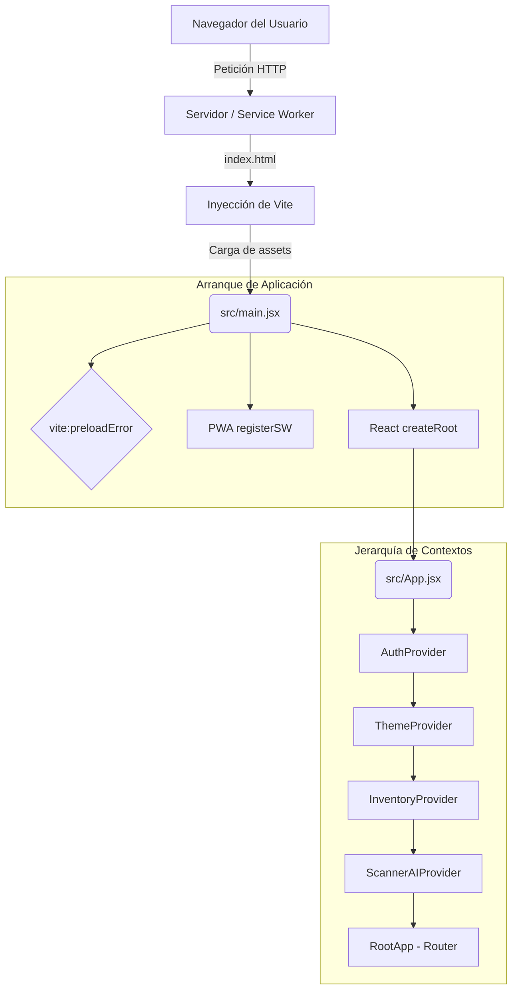

# Manual Técnico de Inventor Manager Pro
## Capítulo 1: Arquitectura General, Ciclo de Vida React y Ecosistema Vite

La plataforma **Inventor Manager Pro** ha sido diseñada bajo una arquitectura moderna enfocada en el rendimiento, la experiencia de usuario (UX) ininterrumpida y las capacidades Offline a través del paradigma Progressive Web App (PWA). Este capítulo desglosa de manera exhaustiva el "qué", el "cómo" y el "por qué" detrás del arranque inicial de la aplicación, abarcando desde el empaquetador (Vite) hasta la inyección en el DOM por parte de React.

---

## 1. Visión General de la Arquitectura del Frontend

El proyecto adopta un modelo de aplicación de página única (SPA) robustecido. La arquitectura general delega la responsabilidad estructural en una serie de capas estrictamente definidas:

1.  **Capa de Construcción y Entrega (Vite + Rollup + Workbox):** Responsable de compilar el código TypeScript/JSX, optimizar los *assets*, inyectar variables de entorno y construir el Service Worker para la caché y capacidades offline.
2.  **Capa de Inyección y Arranque (El Punto de Entrada):** Donde la aplicación interactúa directamente con la API del navegador (DOM, Listeners globales, y validación de versiones).
3.  **Capa de Estado Global (Providers):** Un sistema de "cebolla" (onion architecture) usando la API Context de React para inyectar capacidades (Autenticación, Tema, Datos) antes de renderizar la Interfaz de Usuario.
4.  **Capa de Enrutamiento y Presentación (Router & Lazy Views):** Se encarga de mostrar la interfaz bajo demanda mediante Code-Splitting, protegiendo las rutas según los niveles de acceso del usuario activo.

A continuación, un diagrama que ilustra la topología de carga inicial:



---

## 2. El Punto de Entrada Crítico: `src/main.jsx`

El archivo `main.jsx` constituye la puerta de entrada a toda la aplicación. Su responsabilidad es pequeña en volumen de código, pero fundamental para la estabilidad del cliente.

```jsx
import { StrictMode } from 'react'
import { createRoot } from 'react-dom/client'
import './index.css'
import App from './App.jsx'
import { registerSW } from 'virtual:pwa-register'

// Manejo de errores al cargar chunks cuando se actualiza la app en el servidor
window.addEventListener('vite:preloadError', (event) => {
  window.location.reload();
});

// Registro del Service Worker para soporte offline y PWA
registerSW({ immediate: true })

createRoot(document.getElementById('root')).render(
  <StrictMode>
    <App />
  </StrictMode>,
)
```

### 2.1. Mitigación de "Chunks Huérfanos" (Vite Preload Error)
> [!IMPORTANT]
> **¿Por qué está el listener de `vite:preloadError`?**
> En aplicaciones Single Page Application (SPA) que utilizan *Code-Splitting*, los archivos se dividen en "chunks" con hashes únicos (ej. `InventoryView-a4b9c1.js`). Si un usuario deja la aplicación abierta y, mientras tanto, se despliega una nueva versión al servidor, los hashes cambian y los archivos viejos son eliminados. Cuando el usuario intenta navegar a una nueva vista, el navegador pedirá el hash antiguo que su `index.html` en memoria tiene registrado, provocando un error 404 y dejando la aplicación en un estado de pantalla blanca.

Al interceptar `vite:preloadError`, obligamos al navegador a ejecutar un `window.location.reload()`. Esto descarga forzosamente el nuevo `index.html` del servidor con el manifiesto de archivos actualizados, proporcionando una recuperación silenciosa e instantánea.

### 2.2. Inicialización PWA
El método `registerSW({ immediate: true })` inicializa el *Service Worker* generado por `vite-plugin-pwa`. El parámetro `immediate: true` garantiza que el navegador intente tomar el control y cachear el "App Shell" tan pronto como sea posible, en lugar de esperar inactividad de red.

### 2.3. Montaje Concurrente (`createRoot` y `StrictMode`)
A diferencia de la antigua API de React 17 (`ReactDOM.render`), en React 18/19 se usa `createRoot`. Esto habilita tras bambalinas el "Motor Concurrente" (Concurrent Rendering) de React. Permite que el renderizado se interrumpa para procesar interacciones del usuario de mayor prioridad (como clics o tipeo).
Adicionalmente, se envuelve la app en `<StrictMode>`.

> [!TIP]
> **El comportamiento de StrictMode:**
> En modo desarrollo, `StrictMode` monta, desmonta y vuelve a montar componentes dos veces. Esto no es un bug, es un mecanismo diseñado por el equipo de React para exponer "efectos impuros" (side effects) y fugas de memoria, forzando a los desarrolladores a escribir funciones de limpieza (`cleanup functions`) sólidas en sus `useEffect`.

---

## 3. Jerarquía y Ciclo de Vida: `src/App.jsx`

El archivo `App.jsx` define el esqueleto estructural y lógico. Es el punto donde convergen la autorización, el estado y el enrutamiento.

### 3.1. Arquitectura de Proveedores (Providers)

Al final del archivo, observamos la composición principal:

```jsx
function App() {
  return (
    <AuthProvider>
      <ThemeProvider>
        <InventoryProvider>
          <ScannerAIProvider>
            <RootApp />
          </ScannerAIProvider>
        </InventoryProvider>
      </ThemeProvider>
    </AuthProvider>
  );
}
```

**El orden es de extrema importancia:**
1. **`AuthProvider`**: Debe ser el proveedor más externo porque *todos* los subsistemas posteriores dependen de saber quién es el usuario. Si el usuario no está validado, no tiene sentido inicializar las colecciones completas de inventario.
2. **`ThemeProvider`**: Gobierna la apariencia visual de la app (Modo Oscuro/Claro). Se coloca alto para prevenir destellos de estilos sin procesar (FOUC) en componentes de carga profundos.
3. **`InventoryProvider`**: Sincroniza en tiempo real todo el inventario usando WebSockets (vía Firebase onSnapshot). Requiere la información del usuario del nivel superior para saber a qué empresa/base de datos apuntar.
4. **`ScannerAIProvider`**: Depende del inventario cargado para poder identificar productos a través de Inteligencia Artificial.

### 3.2. Carga Diferida (Code Splitting con Lazy Loading)

```jsx
const InventoryView = lazy(() => import('./views/InventoryView'));
const SettingsView = lazy(() => import('./views/SettingsView'));
const ProfileView = lazy(() => import('./views/ProfileView'));
// ... 
```
El uso exhaustivo de `React.lazy()` en conjunto con `<Suspense>` permite una reducción drástica del "Initial Payload" (el peso de JavaScript necesario para el primer pintado de la pantalla).
Si un trabajador de almacén sólo usa la vista `Dashboard` y `InventoryView`, su navegador **nunca** descargará el código JS necesario para generar facturas (`InvoicesView`) o administrar configuraciones (`SettingsView`). 

### 3.3. Ciclo de Vida del Arranque (RootApp)

Dentro del componente `RootApp`, manejamos el flujo de estados:

1. **Estado de Carga (`if (loading)`)**: Muestra un *loader* visual de alta prioridad ("Validando Sesión..."). En este punto, Firebase Auth está determinando silenciosamente (contra IndexedDB o la red) si existe un token de sesión vivo.
2. **Estado No Autenticado (`if (!user)`)**: Si el contexto de Auth reporta fallo o falta de sesión, la ejecución se interrumpe y se inyecta directamente `<LoginView />`. Esto previene cargar el *Router* completo para usuarios no invitados.
3. **Control de Acceso (`hasViewAccess` & `ViewProtectedRoute`)**: 
   Cada ruta está envuelta por un componente HOC (High Order Component) para seguridad de rutas del lado del cliente.
   
```jsx
const hasViewAccess = (viewId) => {
  if (isAdmin) return true;
  const defaultAllowed = ['dashboard', 'profile'];
  if (defaultAllowed.includes(viewId)) return true;
  if (!userData || !userData.allowedViews) return true; // Retrocompatibilidad
  return userData.allowedViews.includes(viewId);
};
```
Esta función valida los permisos granulares. Note la cláusula de "retrocompatibilidad": si un usuario migrado de una versión vieja de la base de datos no tiene la matriz `allowedViews`, el sistema le otorga paso por defecto para no romper operativas críticas hasta que un admin actualice su perfil.

---

## 4. El Motor Subyacente: Vite en Profundidad (`vite.config.js`)

El corazón que unifica los entornos de Desarrollo y Producción reside en la configuración de Vite. A diferencia de Webpack, que rastrea y compila todo un bundle antes de arrancar, Vite utiliza los *ES Modules* nativos del navegador durante el desarrollo y delega en *Rollup* para la construcción de producción.

### 4.1. Configuración de la PWA y Estrategias de Caché Workbox

> [!CAUTION]
> **El problema de Caché con Firestore REST:**
> En la sección de Workbox (VitePWA plugin), se nota una decisión técnica arquitectónica importante en los comentarios:
> `// NOTA: Firestore REST cache ELIMINADO intencionalmente.`
> 
> Históricamente se podría intentar usar `StaleWhileRevalidate` para peticiones de bases de datos. Sin embargo, el SDK modular de Firebase (v9) administra su propia caché hiper-optimizada y comunicación mediante WebSockets persistentes para el estado en tiempo real (`onSnapshot`). 
> Intentar que el Service Worker se encargue de cachear tráfico de Firebase interfería con el comportamiento de persistencia offline nativa de Firebase, entregando datos estáticos u obsoletos de conteos del servidor. La responsabilidad de los datos transaccionales se le devuelve así al SDK de Firebase.

El Service worker se dedica en cambio a recursos estáticos vitales:
- **Imágenes (Storage)**: `StaleWhileRevalidate` con expiración a 30 días. Muestra la imagen guardada de inmediato pero busca una versión más reciente en segundo plano.
- **Fuentes (Google Fonts)**: `CacheFirst`. Las fuentes son inmutables. Se guardan por 365 días ahorrando enormes latencias en dispositivos móviles.
- **Firebase Auth**: `NetworkFirst`. Garantiza siempre verificar cambios recientes de tokens en la red para seguridad de sesión, pero cae a caché si el usuario entra a un área sin cobertura (sótano de un almacén).

### 4.2. División Granular de Chunks (Rollup Optimization)

En el bloque `build`, se configura el `rollupOptions.output.manualChunks`:

```javascript
manualChunks: {
  vendor: ['react', 'react-dom', 'react-router-dom'],
  firebase: ['firebase/app', 'firebase/auth', 'firebase/firestore', 'firebase/storage'],
  ui: ['lucide-react', 'recharts', 'sonner', 'react-window'],
  utils: ['xlsx', 'qrcode.react']
}
```

Esta estrategia de partición es la columna vertebral del rendimiento de Inventor Manager Pro en producción.

**¿Por qué particionar manualmente?**
1. **Caché a largo plazo (Long-Term Caching):** El ecosistema base (`vendor`: react, router) rara vez se actualiza. Al extraerlo en su propio archivo, el navegador del usuario lo cacheará duramente. Si hacemos un cambio mínimo en el color de un botón, solo se invalida y descarga el pequeño chunk del UI, en lugar de obligar al usuario a volver a descargar los ~100kb+ de las librerías base.
2. **Aislamiento Pesado:** El ecosistema de Firebase y herramientas de utilería (como `xlsx` para lectura/escritura de Excel) pesan mucho. Separándolas garantizamos que el "hilo principal" (Main Thread) del navegador no se atragante analizando megabytes de Javascript a la vez.

## 5. Diferencias del Ciclo: Desarrollo (Dev) vs Producción (Prod)

La interacción entre estos archivos cambia drásticamente dependiendo del entorno en ejecución:

### En Desarrollo (`npm run dev`)
- Vite sirve un servidor HTTP local en milisegundos.
- **NO hay bundling inicial.** Cuando `main.jsx` pide un archivo, Vite lo transpila "al vuelo" (on-demand) utilizando esbuild, y se lo entrega al navegador como un módulo ES nativo (`<script type="module">`).
- **HMR (Hot Module Replacement):** Gracias al plugin `@vitejs/plugin-react`, cuando guardamos un cambio en `App.jsx`, un websocket empuja únicamente el nuevo archivo modificado. React inyecta la actualización en el DOM en vivo conservando todo el estado de la aplicación (ej. la sesión del usuario no se borra, ni se recarga la página completa).

### En Producción (`npm run build`)
- Se invoca a **Rollup**, el cual entra en fase de análisis de todo el árbol de dependencias desde `main.jsx` en adelante.
- Se ejecuta el proceso de **Tree-Shaking**: Todo el código, métodos y variables de bibliotecas instaladas que nunca hayan sido referenciadas, son recortadas del build final.
- Los archivos se minifican y se les agregan hashes en el nombre (ej. `index-a8d2c.js`).
- El plugin de PWA rastrea todos los recursos compilados y genera el archivo `sw.js` inyectando un manifiesto estático interno (precaching list), habilitando así el arranque total sin necesidad de conexión de red alguna a partir de la segunda visita del usuario.

## 6. Conclusión
La arquitectura entrelaza estrechamente la delegación de responsabilidades. `vite.config.js` orquesta con maestría **cómo** se envían los datos sobre la red (Code-splitting y Service Workers), `main.jsx` asegura un ecosistema seguro contra fallos de versión mediante la gestión global de eventos, y `App.jsx` actúa como un gran controlador de tráfico (Traffic Controller), interceptando al usuario según su estado de red, sesión, y permisos de la base de datos, entregando finalmente a demanda, los sub-componentes ligeros diseñados para el inventario.
