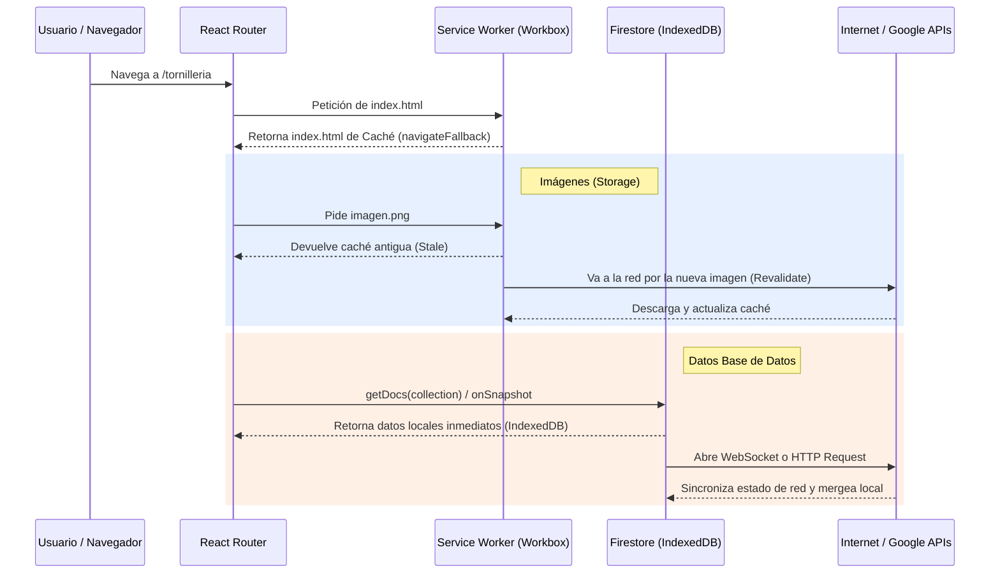

# 5. Configuración PWA y Service Workers

Este capítulo documenta exhaustivamente la arquitectura y configuración de la **Progressive Web App (PWA)** en Inventor Manager Pro. Se aborda la implementación técnica de los Service Workers, el manejo de caché estática y dinámica a través de Workbox, la convivencia con las bases de datos de Firebase, y las políticas de instalación móvil.

---

## 5.1. Arquitectura Base de la PWA

El proyecto utiliza **Vite** en combinación con el ecosistema de **Workbox** a través del plugin oficial `vite-plugin-pwa`. Esta herramienta automatiza la generación del Service Worker y la inyección de los manifiestos, abstrayendo la complejidad de registrar archivos en caché manuales.

La arquitectura se divide en tres capas fundamentales de persistencia:

1. **Caché Estática (App Shell):** Recursos empaquetados por Vite (JS, CSS, HTML).
2. **Caché Dinámica (Runtime Caching):** Peticiones interceptadas en tiempo de ejecución (Imágenes, Fuentes, APIs externas).
3. **Persistencia de Datos (IndexedDB):** Gestionada directamente por el SDK de Firebase (Firestore) para la lógica de negocio y colecciones, separada de Workbox.

> [!NOTE]
> Separar la caché de Workbox (archivos y redes externas) de la caché de datos (Firestore) es una decisión crítica de diseño para prevenir colisiones de estados y datos obsoletos.

---

## 5.2. Configuración Core en `vite.config.js`

El archivo `vite.config.js` es el orquestador principal del Service Worker. Toda la lógica de interceptación de red reside dentro de la instancia de `VitePWA`.

### 5.2.1. Políticas de Actualización (Auto-Update)

```javascript
VitePWA({
  registerType: 'autoUpdate',
  includeAssets: ['favicon.svg', 'apple-touch-icon.png', 'fonts/*.woff2'],
  // ...
})
```

- **`registerType: 'autoUpdate'`**: La aplicación actualizará automáticamente el Service Worker en segundo plano cuando detecte un cambio (un nuevo build). No interrumpe al usuario ni requiere un prompt intrusivo para "Actualizar Aplicación". Al refrescar la página, el nuevo Service Worker asume el control.
- **`includeAssets`**: Asegura que recursos vitales para la experiencia inicial y offline (como fuentes tipográficas y favicons) se precarguen durante la instalación del Service Worker.

### 5.2.2. Web App Manifest y Experiencia Móvil (A2HS)

Para que los navegadores móviles ofrezcan la instalación (Add to Home Screen - A2HS) y el sistema operativo trate la web como una aplicación nativa, se requiere un manifiesto estricto.

```javascript
manifest: {
  name: 'Inventor Manager Pro',
  short_name: 'InventorPro',
  description: 'Gestión de Inventario y Herramientas Profesional',
  theme_color: '#0071e3',
  background_color: '#f5f5f7',
  display: 'standalone',
  orientation: 'portrait',
  icons: [
    { src: 'pwa-192x192.png', sizes: '192x192', type: 'image/png' },
    { src: 'pwa-512x512.png', sizes: '512x512', type: 'image/png' },
    { src: 'pwa-512x512.png', sizes: '512x512', type: 'image/png', purpose: 'any maskable' }
  ]
}
```

> [!IMPORTANT]
> - **`display: 'standalone'`**: Obliga al dispositivo móvil a ocultar la barra de direcciones del navegador (Safari/Chrome), brindando un entorno inmersivo idéntico al de una App nativa.
> - **`purpose: 'any maskable'`**: Requisito crítico para Android moderno. Permite al sistema operativo recortar el icono a formas circulares o cuadradas redondeadas sin perder información visual.

---

## 5.3. Estrategias de Workbox y Caché Dinámica (Runtime Caching)

El comportamiento de red de la aplicación se gestiona interceptando rutas específicas mediante expresiones regulares (`urlPattern`) y aplicando estrategias de Workbox.

### 5.3.1. Navegación Offline y Fallback
```javascript
workbox: {
  globPatterns: ['**/*.{js,css,html,ico,png,svg,woff2}'],
  navigateFallback: 'index.html',
  // ...
}
```
Esto garantiza el soporte SPA (Single Page Application) offline. Si el usuario navega a `/tornilleria` sin conexión, el SW intercepta la petición del navegador y sirve `index.html`. El enrutador del cliente (React Router) toma el control y renderiza la vista pertinente.

### 5.3.2. Tabla de Estrategias de Red (Runtime)

| Recurso | Expresión Regular (`urlPattern`) | Estrategia Workbox | Justificación Técnica |
|---|---|---|---|
| **Firebase Storage (Imágenes)** | `/^https:\/\/firebasestorage\.googleapis\.com\/.*/i` | `StaleWhileRevalidate` | Muestra inmediatamente la imagen guardada en caché (stale), y en segundo plano (background) va por la versión nueva a la red para actualizar la caché. Máx 200 entradas / 30 días. |
| **Google Fonts** | `/^https:\/\/fonts\.(googleapis|gstatic)\.com\/.*/i` | `CacheFirst` | Las tipografías nunca cambian una vez publicadas. Se evita ir a la red si ya están cacheadas. Se almacenan hasta por 1 año para maximizar el rendimiento de pintado de la UI. |
| **Firebase Auth (Sesión)** | `/^https:\/\/(www\.googleapis\.com\/identitytoolkit\|securetoken\.googleapis\.com)\/.*/i` | `NetworkFirst` | **Crítico para seguridad.** Se prioriza la red (timeout: 10s) para validar credenciales. Si el dispositivo está offline, cae a la caché, permitiendo la reautenticación local sin forzar cierres de sesión por pérdida de red temporal. |

---

## 5.4. Exclusión de Firestore de Workbox (Decisión Arquitectónica)

> [!CAUTION]
> **No se cachean peticiones REST de Firestore.** En el archivo `vite.config.js` se eliminó intencionalmente el caché de rutas `firestore.googleapis.com`.

**El problema resuelto:**
Inicialmente, los Service Workers globales suelen interceptar y cachear todo tráfico de red, incluyendo APIs de Firebase. 
Sin embargo, el SDK de Firestore opera a través de conexiones persistentes (WebSockets) para los listeners de tiempo real (`onSnapshot`), las cuales no son interceptables por el Service Worker. 

No obstante, ciertas operaciones puntuales (como `getCountFromServer` o lecturas únicas no suscritas) sí utilizan transporte REST/Fetch. Si Workbox intercepta esto, devolverá datos cacheados obsoletos en vez del conteo real de la base de datos, corrompiendo la paginación y las validaciones de inventario.

**La Solución:**
El manejo offline de la base de datos se delega al 100% al SDK de Firebase (`enableIndexedDbPersistence()`), el cual posee control preciso y lógico sobre las mutaciones pendientes (offline writes) y la reconciliación con el servidor, ignorando a Workbox para la transferencia de JSON de colecciones.

---

## 5.5. Registro y Ciclo de Vida en el Frontend (`main.jsx`)

La integración del Service Worker con el código cliente se realiza en el punto de entrada de React (`src/main.jsx`).

### 5.5.1. Inicialización Inmediata
```javascript
import { registerSW } from 'virtual:pwa-register'

registerSW({ immediate: true })
```
Al inyectar `virtual:pwa-register`, Vite provee el proxy que inyecta la lógica de Workbox generada en tiempo de compilación. El parámetro `immediate: true` fuerza al navegador a activar el Worker inmediatamente en el ciclo de vida sin esperar la recarga total, minimizando la ventana temporal donde los recursos no están cacheados.

### 5.5.2. Mitigación de Errores de Vite Preload

> [!TIP]
> Manejo defensivo contra los errores de "Chunk Load".

```javascript
window.addEventListener('vite:preloadError', (event) => {
  window.location.reload();
});
```

En arquitecturas PWA con Code Splitting agresivo (separación por chunks: `vendor`, `firebase`, `ui`), si el servidor despliega una nueva versión, los hashes de los archivos `.js` cambian. Si un cliente tenía abierta la aplicación antigua e intenta navegar a una vista diferida (`lazy load` de React), fallará tratando de descargar un chunk que ya no existe en el servidor.
El evento `vite:preloadError` captura esta colisión y fuerza un `reload` del documento, lo cual invoca al Service Worker nuevo que descargarán instantáneamente los chunks actualizados, previniendo la pantalla blanca de la muerte (White Screen of Death).

---

## 5.6. Diagrama de Flujo: Peticiones y Caché



## 5.7. Resumen de Despliegue Móvil

Para que el dispositivo ofrezca instalar "Inventor Manager Pro":
1. **HTTPS Requerido:** El Service Worker no se registrará sin un contexto seguro (TLS), excepto en `localhost`.
2. **Iconos Maskable:** Previene marcos feos (padding blanco) en Android y iOS.
3. **Manejo de Apple (iOS):** Aunque Android interpreta el manifest de forma nativa para A2HS, el plugin inyecta de forma automatizada las etiquetas `<link rel="apple-touch-icon">` requeridas para que Safari permita agregarlo a la pantalla de inicio con la máxima compatibilidad.
