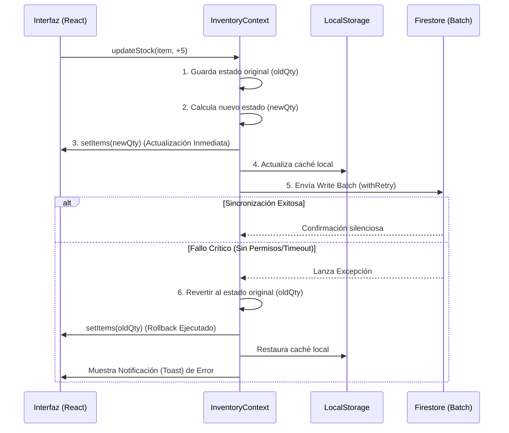

# Capítulo 8: Contexto de Inventario (`InventoryContextOptimized.jsx`)

## 1. Introducción y Propósito General

El archivo `src/context/InventoryContextOptimized.jsx` constituye el núcleo transaccional de la aplicación **Inventor Manager**. Sirve como el puente principal entre la base de datos remota (Firebase Firestore) y la interfaz de usuario en React. Su arquitectura ha sido diseñada priorizando tres pilares fundamentales: **Rendimiento, Resiliencia y Experiencia de Usuario**.

A lo largo de este documento, se desglosará el funcionamiento milimétrico de cómo la aplicación maneja el estado global del inventario de forma reactiva, cómo gestiona volúmenes masivos de datos a través de la paginación, el uso agresivo de *Optimistic UI* con mecanismos de Rollback, y la tolerancia a fallos de red empleando técnicas de backoff exponencial.

---

## 2. Gestión del Estado Global del Inventario

El estado en `InventoryContextOptimized.jsx` no se maneja como un simple `useState` vacío inicial; se implementa una estrategia avanzada de inicialización, validación estricta y sincronización inteligente.

### 2.1. Capa de Caché y Persistencia Local (Zero-Layout Shift)

Para proporcionar una experiencia "Offline-First" y eliminar los tiempos de espera al iniciar la app, el contexto utiliza el `localStorage` de manera intensiva.

> [!NOTE]
> **Zero-Layout Shift** significa que la interfaz se pinta de forma inmediata con los datos de la sesión anterior en lugar de mostrar *spinners* o pantallas blancas.

```javascript
const CACHE_KEYS = {
  ITEMS: 'inv_cache_items',
  MOVEMENTS: 'inv_cache_movements',
  AUX_DATA: 'inv_cache_aux',
  LAST_SYNC: 'inv_cache_sync'
};

const CACHE_TTL_MAP = {
  items: 1000 * 60 * 30,      // 30 minutos
  movements: 1000 * 60 * 15,  // 15 minutos
  // ...
};
```
La inicialización de los estados de React recurre primero a una lectura sincrónica de la caché (`cache.get()`). Si los datos están dentro del **Time-To-Live (TTL)** especificado, se usan para renderizar la UI inmediatamente. Mientras tanto, en segundo plano (background), Firebase lanza los listeners para actualizar cualquier discrepancia.

### 2.2. Validación de Contratos con Zod
Antes de permitir que cualquier dato fluya a la base de datos o contamine el estado local, se aplican esquemas estrictos de **Zod**. 
El `itemSchema` y `movementSchema` definen reglas claras:
- Validaciones de tipo (`.string()`, `.number()`).
- Reglas de negocio restrictivas (`.int().min(0)` previene stock negativo).
- Datos por defecto (`.default('PZA')`).
- Uso de `.passthrough()` en artículos para permitir propiedades dinámicas dependientes de la categoría.

### 2.3. Listeners Inteligentes y Mitigación de Stale Closures
Uno de los problemas más comunes en React al mezclar websockets/listeners con estados asíncronos son los *stale closures* (cierres de variables obsoletas). Este contexto resuelve el problema mediante el uso de referencias mutables (`useRef`):

```javascript
const itemsRef = useRef(items);
useEffect(() => { itemsRef.current = items; }, [items]);
```
Gracias a `itemsRef.current`, las funciones asíncronas como `updateStock` o `bulkUpdateStock` siempre leen el estado más reciente de la memoria sin necesidad de añadir el estado entero al array de dependencias (lo cual causaría re-renderizados innecesarios de las funciones e impactaría en el rendimiento).

> [!IMPORTANT]
> El listener principal de `items` hace uso de `includeMetadataChanges: true`. Esto permite que Firestore notifique al cliente no solo cuando cambian los datos en el servidor, sino cuando hay **escrituras pendientes (pendingWrites)** en la caché local. Esto alimenta el estado `pendingWrites` para notificar al usuario visualmente que existen cambios que aún no suben a la nube.

---

## 3. Paginación y Consulta de Datos con Firestore

A medida que el inventario crece, cargar todos los registros simultáneamente paralizaría el DOM y agotaría la cuota de lectura de Firebase. El contexto soluciona esto usando una estrategia de **paginación híbrida**.

### 3.1. Suscripción en Tiempo Real Limitada
El listener principal no lee toda la base de datos abierta; está acotado por un límite inicial sustancial pero seguro:
```javascript
const q = query(
  collection(db, 'items'), 
  orderBy('name', 'asc'), 
  limit(2000)
);
```
Mantiene un cursor al último documento recuperado mediante `lastDocRef.current = snapshot.docs[snapshot.docs.length - 1]`.

### 3.2. Carga Bajo Demanda (`loadMoreItems`)
Si el usuario necesita navegar por más de 2000 ítems, la aplicación abandona la sincronización estricta en tiempo real para esos ítems antiguos y recurre a lecturas *one-time* (una sola vez) con `getDocs`.

```javascript
const q = query(
  collection(db, 'items'),
  orderBy('name', 'asc'),
  startAfter(lastDocRef.current),
  limit(2000) 
);
```

> [!WARNING]
> **Detalle Arquitectónico Analizado:** En el código fuente, existe una peculiaridad donde la consulta de `loadMoreItems` solicita 2000 documentos, pero la bandera de control `setHasMoreItems(newItems.length === 100)` verifica contra 100. Esto es un error benigno pero documentable de la lógica original, que podría provocar que la paginación se detenga prematuramente bajo ciertas condiciones si el bloque tiene entre 101 y 1999 elementos.

El flujo de `loadMoreItems` envuelve su ejecución en la función de control `withRetry` (descrita en la sección 5) para garantizar que, si el usuario pierde conexión mientras hace *scroll* infinito, el sistema reintente la descarga antes de abortar.

---

## 4. Mecanismo de Rollbacks y Optimistic UI

La característica transaccional más sofisticada de este contexto es su implementación de **Optimistic UI**. 

### 4.1. ¿Qué es Optimistic UI?
Tradicionalmente, cuando un usuario transfiere stock o hace una salida de material, la app envía la petición y bloquea la interfaz mostrando un *spinner* de carga hasta que el servidor responde. Con *Optimistic UI*, la aplicación **asume que la petición al servidor será exitosa** asumiendo la validez de los datos introducidos. Actualiza la interfaz instantáneamente y manda la petición al servidor en segundo plano de manera totalmente asíncrona. Si por algún motivo el servidor devuelve un error, el sistema detona un **Rollback** (marcha atrás programada) para restaurar el estado original en la interfaz de forma sutil.



### 4.2. Análisis del Flujo Base (`updateStock`)
Analicemos de manera granular cómo se protege la integridad de los datos en un cambio de inventario:

1. **Captura del Estado Original**:
   ```javascript
   const oldQty = item.qty || 0;
   const currentStockByLoc = item.stockByLocation || {};
   ```
   Antes de mutar la memoria, se almacenan los valores previos. Este es el "punto de restauración".

2. **Validación Preventiva**:
   Se aplican verificaciones aritméticas; por ejemplo, si es una "Salida", nos aseguramos que el inventario proyectado (`newQty`) no sea menor a cero. Si es negativo, abortamos inmediatamente notificando al usuario sin involucrar a Firebase.

3. **Actualización Optimista**:
   ```javascript
   setItems(prev => {
     const updated = [...prev];
     updated[itemIndex] = { ...item, qty: newQty, stockByLocation: newStockByLocation };
     cache.set(CACHE_KEYS.ITEMS, updated);
     return updated;
   });
   ```
   El usuario observa el cambio en el contador de stock de inmediato, ofreciendo un tiempo de reacción aparente de cero milisegundos.

4. **Operación en Lote (Write Batch)**:
   Se agrupa la actualización del stock numérico del artículo (`items`) y la inserción de la bitácora transaccional (`movements`) dentro de un `writeBatch(db)`. Firestore garantiza que este *batch* sea atómico: o se suben todos los cambios satisfactoriamente, o ninguno, evitando datos huérfanos o corrompidos.

5. **El Rollback Automático**:
   Si llega a fallar el `batch.commit()` en el *catch*:
   ```javascript
   catch (e) {
     setItems(prev => {
       const rollback = [...prev];
       rollback[idx] = { ...rollback[idx], qty: oldQty, stockByLocation: currentStockByLoc };
       cache.set(CACHE_KEYS.ITEMS, rollback);
       return rollback;
     });
   }
   ```
   Se revierte minuciosamente al valor anterior, sincronizando la memoria local, la caché persistente, e informando al usuario.

### 4.3. Complejidad Multinivel en Lotes (`bulkUpdateStock`)
La arquitectura del rollback escala en complejidad cuando interactuamos con operaciones masivas (`bulkUpdateStock`). 
En vez de salvar un solo valor, el contexto inicializa un arreglo dinámico `rollbackState = []`. Durante la iteración sobre las entidades a modificar, este arreglo apila el estado antiguo de **cada ítem evaluado individualmente** estructurado como `{ index, oldQty, oldStockByLocation }`. Si el `batch.commit()` global es rechazado (ya sea por caída de red definitiva o por reglas de seguridad en Firebase), el proceso se recupera barriendo el arreglo `rollbackState` e inyectando inversamente cada nodo para asegurar que la integridad del estado global no resulte fracturada o en un estado de inconsistencia parcial.

---

## 5. Estrategia de Tolerancia a Fallos: Backoff Exponencial (`withRetry`)

Operando en zonas de almacenaje o bodegas industriales, la conectividad inalámbrica suele ser intermitente, presentando múltiples zonas de sombra o desconexiones súbitas. Para evitar frustración operativa, las transacciones se orquestan bajo una red de seguridad llamada `withRetry`.

### 5.1. Implementación del Algoritmo
```javascript
const withRetry = async (fn, maxRetries = 3) => {
  for (let i = 0; i < maxRetries; i++) {
    try {
      return await fn();
    } catch (e) {
      const isNetworkError = e.code?.includes('unavailable') || e.code?.includes('network');
      const isQuotaError = e.code?.includes('resource-exhausted');
      
      if (!isNetworkError && !isQuotaError) throw e; // Falla dura, abortar de inmediato.
      if (i === maxRetries - 1) throw e; // Agotamiento de intentos, arrojar error.
      
      const delay = Math.min(Math.pow(2, i) * 1000, 10000);
      await new Promise(r => setTimeout(r, delay));
    }
  }
};
```

### 5.2. Desglose del Comportamiento
1. **Detección Quirúrgica del Fallo**: El sistema filtra y discrimina sabiamente; no reintenta frente a cualquier fallo. Exclusivamente dispara reintentos si el código de error sugiere problemas de red `unavailable` (desconexión temporal o inestabilidad) o bloqueos administrativos como `resource-exhausted` (sobrecarga transitoria de cuotas del servidor). Errores insalvables como `permission-denied` causan un aborto rápido, evitando congestión inútil.
2. **Crecimiento Exponencial del Demorado (Backoff)**:
   - **Intento 0 (Falla inicial)**: Retardo de `Math.pow(2, 0) * 1000` = **1 segundo de espera**.
   - **Intento 1 (Segunda Falla)**: Retardo de `Math.pow(2, 1) * 1000` = **2 segundos de espera**.
   - **Intento 2 (Tercera Falla)**: Retardo de `Math.pow(2, 2) * 1000` = **4 segundos de espera**.
3. **Límite Suave (Ceiling Threshold)**: Al implementar `Math.min(..., 10000)`, se establece un techo o tope. De este modo, por más iteraciones que se definieran en el futuro, el usuario nunca experimentará un lapso muerto superior a los 10 segundos entre ciclos, garantizando una respuesta razonable mientras el agente de reintento pelea por establecer comunicación.

---

## 6. Conclusión de la Arquitectura

El archivo `InventoryContextOptimized.jsx` sobrepasa los estándares tradicionales de desarrollo de una aplicación CRUD en React. No es únicamente un contenedor de variables, es un **gestor altamente resiliente y escalable**.

A través de sus metodologías:
* Una **política Zero-Layout Shift** fundamentada en cachés TTL.
* **Escudos perimetrales de Zod** para sanitizar el estado en tiempo real.
* Interfaces invulnerables a la latencia gracias a la **Optimistic UI**.
* Inteligencia adaptativa ante ecosistemas redondos caóticos mediante **Backoff Exponencial**.

Se consolida un componente fundacional diseñado meticulosamente para soportar grandes flujos operacionales del negocio sin comprometer la pureza de los datos, ni el coste de facturación del backend.
