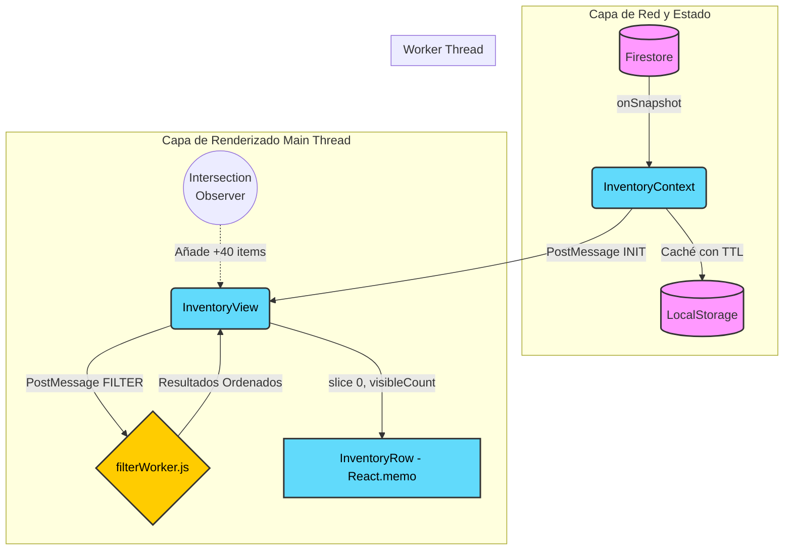

# Capítulo 09: Arquitectura y Performance en Renderizado de Listas Virtualizadas

En aplicaciones empresariales como **Inventor Manager**, la gestión de inventarios escala rápidamente de decenas a miles de artículos por sección. Presentar estos datos en una interfaz de usuario (UI) reactiva, rica en interacciones (imágenes, estados, botones de acción) e interactiva presenta un reto técnico crítico: la **saturación del Main Thread** y el desbordamiento de memoria por nodos en el DOM.

Originalmente, el proyecto contemplaba técnicas de virtualización puras basadas en librerías externas (trazas aún visibles en `package.json` con dependencias como `react-window` y `react-virtualized-auto-sizer`). Sin embargo, debido a necesidades de máxima compatibilidad en flujos responsive, cálculo dinámico de alturas para tarjetas (Custom Categories) y problemas con contextos anidados en ventanas modales, **la arquitectura evolucionó hacia un modelo híbrido de Paginación Progresiva en Memoria asistida por Web Workers**.

Este capítulo detalla el _qué_, el _cómo_ y el _por qué_ de la arquitectura actual para la visualización de alto performance.

---

## 1. El Problema: Costo del Renderizado y "Virtualización Compleja"

La renderización de listas en React sin control causa que cada nodo generado consuma un impacto directo en el *Virtual DOM* y subsecuentemente en el DOM del navegador. Una vista de 2,000 elementos interactivos podría resultar en más de 40,000 elementos HTML. 

### ¿Por qué se abandonó `react-window`?

> [!WARNING]
> La virtualización clásica (renderizar solo lo que está en el viewport) es extremadamente veloz para filas simples de altura estática, pero introducía fricción crítica en Inventor Manager.

1. **Alturas Dinámicas (Dynamic Heights)**: En Inventor Manager, la altura de un `InventoryRow` no es constante. Los campos adicionales (Custom Categories), si están presentes, incrementan el espacio. Los layouts con `react-window` (particularmente `VariableSizeList`) requieren medir y recalcular constantemente el layout, lo cual contrarresta los beneficios de rendimiento.
2. **Scroll Constraints**: El scroll en interfaces Mobile o contenedores fluidos CSS se rompe o sufre de *scroll jacking* cuando la lista virtual tiene control absoluto del offset de desplazamiento.
3. **"Eliminada virtualización compleja para máxima compatibilidad"**: Como reza el comentario en `InventoryView.jsx`, simplificar el modelo hacia un *Infinite Scroll local* permitió retener el flujo nativo de Flexbox/CSS Grid y mantener los comportamientos modales intactos.

---

## 2. Arquitectura de Renderizado Progresivo (Hybrid Approach)

La solución técnica está particionada en 4 capas concurrentes y asíncronas para liberar el Event Loop:



---

## 3. Descarga de Trabajo Pesado: `filterWorker.js`

El punto más costoso antes de renderizar no es pintar, sino **buscar, filtrar y ordenar** miles de cadenas de texto cada vez que el usuario presiona una tecla (Búsqueda textual as you type). 

Para evitar un "UI Jank" (congelamiento de fotogramas), se desacopla toda esta algoritmia hacia un **Web Worker**.

### Implementación y Manejo de Índices
El Worker recibe la orden `FILTER` y procesa los arreglos. Se prestó especial atención en la memoria:

```javascript
// file: filterWorker.js
// Búsqueda textual pre-calculada
const match = (
  (item.name && item.name.toLowerCase().includes(searchLow)) ||
  // ... más campos
);

// Técnica de ordenamiento desacoplado (Evita mutaciones costosas)
const len = filtered.length;
const keys = new Array(len);
for (let i = 0; i < len; i++) {
  keys[i] = (filtered[i].name || '').trim().toLowerCase();
}

const indices = new Array(len);
for (let i = 0; i < len; i++) indices[i] = i;

// Sort de solo un array de integers en lugar del objeto masivo entero
indices.sort((a, b) => {
  if (keys[a] < keys[b]) return -1;
  if (keys[a] > keys[b]) return 1;
  return 0;
});
```

> [!TIP]
> **Técnica de Optimización de Ordenamiento:** Al crear un array de `keys` (las cadenas a comparar) y un array de `indices`, se ordenan los índices basándose en la precomputación del LowerCase. Esto es asombrosamente rápido, porque no invoca `.toLowerCase()` múltiples veces durante el proceso comparativo recursivo del `Array.prototype.sort`.

### Integración en `InventoryView.jsx`
La conexión requiere evitar bombardeos al worker (Throttling/Debouncing):
```javascript
useEffect(() => {
  const timer = setTimeout(() => {
    setDebouncedSearch(searchTerm);
    setVisibleCount(40); // Reset scroll on search
  }, 150);
  return () => clearTimeout(timer);
}, [searchTerm]);
```
Un debounce de 150ms es el punto dulce entre "sensación de tiempo real" y evitar colapsar el Worker Thread con llamadas encoladas.

---

## 4. Renderizado Progresivo con Intersection Observer

En lugar de renderizar 2,000 elementos tras la carga inicial, `InventoryView` aplica un slice sobre los datos procesados del Worker:

```javascript
{filteredItems.slice(0, visibleCount).map((item, index) => (
  <InventoryRow key={item.id} item={item} ... />
))}
```

### El Centinela del Final de Lista
Al fondo del bloque, reside un div observador oculto (el "centinela"):

```javascript
// InventoryView.jsx
const observerTarget = useCallback(node => {
  if (loading) return;
  if (observer.current) observer.current.disconnect();
  
  observer.current = new IntersectionObserver(entries => {
    if (entries[0].isIntersecting) {
      setVisibleCount(prev => prev + 40);
    }
  }, { threshold: 0.1, rootMargin: '200px' });
  
  if (node) observer.current.observe(node);
}, [loading]);
```

> [!IMPORTANT]
> **El Root Margin:** El valor `rootMargin: '200px'` indica que el Intersection Observer disparará el evento 200 píxeles **antes** de que el usuario haya hecho scroll hasta el fondo real. Esto provoca que el usuario nunca perciba un "corte", ya que el renderizado de los siguientes 40 ítems se produce proactivamente.

---

## 5. Cirugía Fina en las Props de Componentes Altamente Anidados

Cuando la lista inyecta 40, luego 80, y luego 120 elementos en el DOM, es crítico que las filas preexistentes **no se vuelvan a renderizar** a menos que algo haya mutado. La reactividad por defecto de React re-renderiza todos los hijos cuando el estado del padre cambia (por ejemplo, el estado de un modal en `InventoryView`).

### 5.1. El Patrón `React.memo` y Dependencias de Valor Primitivo
Se diseñó `InventoryRow` para ser impermeable:

```javascript
const InventoryRow = React.memo(({ item, index, isSelected, onToggleSelect, handlers ... }) => {
  // ...
});
```

El error más común en listas con selección múltiple es pasar un estado objeto. Si enviamos `selectedItems` (un `Set()` con las IDs elegidas) a *todas* las filas, *todas* las filas se re-renderizarán cada vez que se seleccione un nuevo ítem, porque el `Set` crea una nueva referencia.
En cambio, el cálculo ocurre *en el padre*, aislando a la fila:

```javascript
// MAL (Provoca renders masivos)
<InventoryRow selectedList={selectedItems} /> 

// EXCELENTE (Solo pasa booleanos, y no rompe React.memo)
<InventoryRow isSelected={selectedItems.has(item.id)} />
```

### 5.2. Empaquetado Estricto de Callbacks
De la misma forma, las funciones de acción como "Eliminar" o "Transferir" cambian de puntero si se declaran en el cuerpo del render. Para blindar a `InventoryRow`, se compilan en un mega-objeto de handlers utilizando `useMemo`:

```javascript
const handlers = useMemo(() => ({
  handleDelete: (item) => { ... },
  handleEdit: (item) => { ... },
  handleAction: (item) => { ... },
}), [deleteItem, returnItem, userData]);
```
Así, las 2,000 posibles filas comparten en memoria **la misma referencia** para el paquete de eventos. 

---

## 6. Sincronización Escalada con Firebase

Mantener el cliente veloz significa no saturar la red (prevenir errores `429 Resource Exhausted` u `OutOfMemory`).

### Descarga Inicial Asimétrica
El `InventoryContextOptimized` establece una descarga limitante estricta:
```javascript
const q = query(
  collection(db, 'items'), 
  orderBy('name', 'asc'), 
  limit(2000)
);
```

Para las instancias donde existan inventarios masivos (>2,000 elementos), se ejecuta el fallback de **Paginación en Red**:

```javascript
// Función disparada por el usuario para traer el siguiente chunk
const loadMoreItems = async () => {
    const q = query(
      collection(db, 'items'),
      startAfter(lastDocRef.current),
      limit(2000)
    );
    // ... anexión al caché
};
```

### Caché Ofensivo (Offline-First)
Todo lo recolectado no se desperdicia. Utilizando persistencia vía *LocalStorage* (`cache.set(CACHE_KEYS.ITEMS, data)`), Inventor Manager es capaz de sortear el tiempo de espera inicial en recargas y provee resiliencia completa ante la pérdida de señal, actualizando instantáneamente la vista mientras la capa de red revalida el estado en un proceso por detrás.

---

## 7. Conclusión

El reemplazo del patrón de "Virtualización Friccional" (`react-window`) por **Paginación Progresiva Asistida por Workers** brinda:
1. **Un Thread Limpio**: El Event Loop de JS en el navegador nunca se traba mientras se filtra o se navega.
2. **Experiencia CSS Predictible**: Layouts como CSS Grid, flex-wrap y sticky footers funcionan de forma nativa sin *hacks* sobre las alturas absolutas.
3. **Escalabilidad de DOM**: Al limitar con el `visibleCount`, se obtiene lo mejor de ambos mundos; velocidad de carga virtual e interactividad de DOM nativa.

Este es un excelente modelo de ingeniería donde entender **dónde se localiza el cuello de botella (ordenamiento de strings) antes que la visualización misma** permitió crear un sistema mucho más liviano y flexible.
