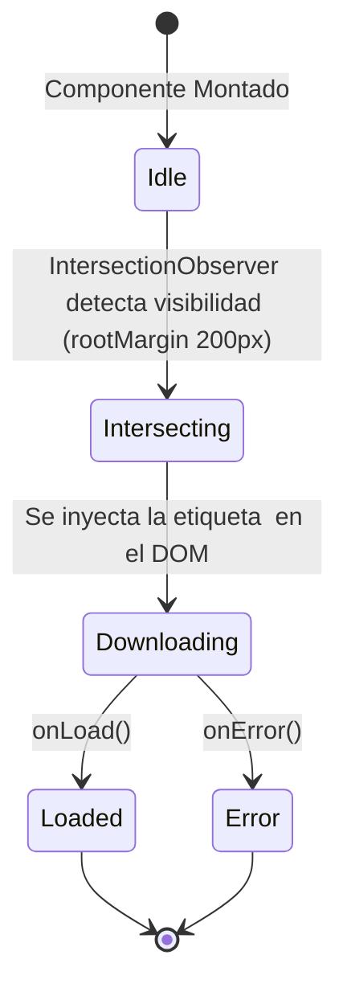

# Capítulo 14: Optimización de Imágenes y Lazy Loading

En aplicaciones modernas con un alto volumen de contenido visual —como un sistema de gestión de inventario— la carga indiscriminada de imágenes puede paralizar el rendimiento, agotar la memoria del dispositivo y consumir innecesariamente el ancho de banda del usuario. El componente `OptimizedImage.jsx` aborda estos desafíos de manera sistemática.

Este capítulo detalla exhaustivamente la arquitectura, funcionamiento interno y los beneficios técnicos del componente `OptimizedImage`, haciendo especial hincapié en el uso del API de `IntersectionObserver`, la implementación del efecto *shimmer* (esqueleto) y las estrategias para mitigar los cuellos de botella en la memoria gráfica del cliente.

---

## 1. Problemas de Rendimiento con Imágenes

Cuando el navegador encuentra etiquetas `` estándar en el DOM, por defecto intentará descargar, decodificar y almacenar en la memoria gráfica (GPU/VRAM) todas las imágenes simultáneamente. En una vista de lista o cuadrícula con cientos de productos, esto genera:

- **Agotamiento de VRAM:** Cada imagen decodificada requiere una cantidad significativa de memoria sin comprimir.
- **Main Thread Blocking:** La decodificación síncrona de múltiples imágenes congela la interfaz de usuario.
- **Desperdicio de Red:** Se descargan imágenes que el usuario quizás nunca llegue a ver (elementos fuera del área visible).

Para resolver estos problemas, hemos diseñado un componente envolvente (Wrapper) en React que controla exactamente **cuándo** y **cómo** el navegador interactúa con la imagen.

---

## 2. Arquitectura del Componente `OptimizedImage`

El componente se construye sobre React mediante el uso de referencias (`useRef`) y estados locales (`useState`). 

### Máquina de Estados

El comportamiento de la imagen se rige a través de tres estados booleanos fundamentales:

| Estado | Tipo | Propósito |
| :--- | :---: | :--- |
| `isInView` | `boolean` | Determina si el componente está dentro (o cerca) del *viewport*. Inicialmente es `false`. |
| `isLoaded` | `boolean` | Indica si el recurso de imagen se ha descargado y decodificado exitosamente. |
| `hasError` | `boolean` | Se activa si la carga del recurso falla, previniendo bucles de recarga infinitos. |

### Diagrama de Flujo (Mermaid)



> [!NOTE]
> Para evitar múltiples renderizados innecesarios en el árbol de componentes padre (especialmente útil en listas o tablas de datos grandes), el componente completo está envuelto en `React.memo(OptimizedImage)`. Esto garantiza que solo se re-renderice cuando sus propiedades, como el `src`, sufran una mutación real.

---

## 3. Lazy Loading mediante `IntersectionObserver`

La base fundamental de la optimización recae en retrasar la existencia misma de la etiqueta `` hasta que sea estrictamente necesario. 

Tradicionalmente, el *Lazy Loading* se lograba añadiendo escuchadores (listeners) al evento `scroll` de la ventana. Esto es una mala práctica moderna, ya que el evento de *scroll* se dispara cientos de veces por segundo y sufre de problemas de rendimiento (layouts síncronos forzados o thrashing) si se consulta `getBoundingClientRect()`.

El API **IntersectionObserver** delega esta responsabilidad al navegador de forma nativa y asíncrona, desvinculándola por completo del hilo principal de JavaScript.

### Implementación Técnica

```javascript
useEffect(() => {
  if (!imgRef.current) return;

  observerRef.current = new IntersectionObserver(
    ([entry]) => {
      if (entry.isIntersecting) {
        setIsInView(true);
        observerRef.current?.disconnect();
      }
    },
    { rootMargin: '200px' } 
  );

  observerRef.current.observe(imgRef.current);

  return () => {
    observerRef.current?.disconnect();
    observerRef.current = null;
  };
}, []);
```

#### Anatomía del Observador:

1. **Creación y Asignación:** Se inicializa una nueva instancia de `IntersectionObserver` y se almacena en un ref (`observerRef`). Esto es vital para poder desconectarlo posteriormente, incluso durante desmontajes del componente.
2. **Umbral de Intersección:** Al evaluarse el array de entradas `([entry])`, inspeccionamos la propiedad `entry.isIntersecting`.
3. **Mecanismo de Desconexión Temprana:** Una vez que la imagen ha entrado en la vista (o dentro de su margen), mutamos el estado llamando a `setIsInView(true)`. Inmediatamente después, invocamos `disconnect()`. Esto indica que no nos interesa saber cuándo la imagen sale de la pantalla; una vez iniciada la carga, la imagen persistirá en el DOM.
4. **El Secreto del `rootMargin`:** El segundo argumento `{ rootMargin: '200px' }` es un pilar de la experiencia de usuario. En lugar de esperar a que la imagen entre exactamente en la pantalla visible, el observador expande su caja de colisión invisible en 200 píxeles hacia todos los bordes. Esto permite **pre-cargar** las imágenes justo antes de que el usuario las alcance mediante el *scroll*, logrando que para el momento en que visualice el contenedor, la imagen muy probablemente ya esté descargada, evitando que vea el esqueleto.

---

## 4. Prevención de Cuellos de Botella en Memoria Gráfica

Retrasar la inserción de la etiqueta `` tiene un impacto directo en la reducción de consumo de red, pero además, `OptimizedImage` implementa atributos clave que salvan la memoria VRAM y CPU:

```javascript
const showImage = isInView && src && !hasError;

// Renderizado condicional
{showImage && (
  
)}
```

### Renderizado Condicional Físico

A diferencia de soluciones que simplemente cambian el estilo (`display: none`), nosotros evitamos que el elemento `` se encuentre en el DOM virtual inicial.
Si `isInView` es falso, el nodo imagen no existe. Esto significa que el motor de renderizado del navegador ignora por completo la necesidad de asignar buffers de memoria de textura para estas imágenes.

### Los Atributos "Bulletproof"

Incluso cuando inyectamos la imagen, dependemos de capacidades modernas:

- **`loading="lazy"`**: Aunque nosotros ya hacemos *Lazy Loading* condicional con Intersection Observer, mantener este atributo actúa como una red de seguridad (fallback) e instruye a los navegadores modernos que esta imagen tiene baja prioridad en la cascada de recursos.
- **`decoding="async"`**: Este es, con seguridad, el atributo más crítico para evitar el "congelamiento" o jank. Cuando una imagen de alta resolución, especialmente en formatos pesados como JPEG estándar o PNG sin optimizar, se ha descargado, el navegador debe decodificarla desde sus bytes binarios a una matriz de mapa de bits sin comprimir antes de enviarla a la GPU. Al usar `async`, permitimos que este cómputo intensivo se transfiera fuera del hilo principal (main thread), garantizando que las animaciones de la interfaz y la respuesta táctil o del ratón permanezcan fluidas a 60 FPS (Frames Por Segundo).

> [!TIP]
> **Recomendación para Escalabilidad**: Para inventarios con miles de SKU (Stock Keeping Units), la combinación de desvinculación asíncrona (`decoding="async"`) junto a renderizado diferido reduce radicalmente el consumo de RAM en dispositivos móviles de gama baja.

---

## 5. Experiencia de Usuario: El Efecto Shimmer (Esqueleto)

Cargar contenido diferido introduce inevitablemente una ventana de tiempo en la que el usuario está viendo un espacio vacío. Las pantallas en blanco son cognitivamente perjudiciales, induciendo frustración o la percepción de que la aplicación "está rota". 

Para mitigar esto, utilizamos el patrón de **Skeleton Loading** mediante un **Efecto Shimmer**, indicando de manera visual que un proceso de obtención de datos (fetching) está transcurriendo en esa área específica.

### Renderizado del Esqueleto

```javascript
{!isLoaded && (
  <div style={{
    position: 'absolute',
    top: 0,
    left: 0,
    width: '100%',
    height: '100%',
    background: 'linear-gradient(90deg, #f1f5f9 25%, #e2e8f0 50%, #f1f5f9 75%)',
    backgroundSize: '200% 100%',
    animation: 'shimmer 1.5s infinite'
  }} />
)}
```

#### Explicación del CSS de Esqueleto

1. **Posicionamiento Absoluto:** El contenedor padre del componente requiere tener `position: 'relative'` y un `minHeight` establecido (en este caso de `40px`). El marcador del *shimmer* se extiende para abarcar el `100%` del ancho y alto de su padre gracias a `position: 'absolute'`, superponiéndose en caso de que la imagen ya se esté renderizando en la capa inferior pero sin haber completado aún su evento `onLoad`.
2. **El Gradiente (`linear-gradient`):** Creamos una transición tricolor a 90 grados. Empieza con un color de base muy claro (`#f1f5f9`), pasa a un gris ligeramente más oscuro en el centro (`#e2e8f0` a 50%) y vuelve al claro original. Esto crea el "rayo de luz" que se moverá a través del contenedor.
3. **Tamaño del Fondo (`backgroundSize: '200% 100%'`):** Al duplicar la anchura horizontal del gradiente (200%), nos aseguramos de que el efecto completo se desplace ocultando parte fuera del contenedor en los extremos, logrando un ciclo ininterrumpido y natural al animar `background-position`.
4. **Animación CSS (`shimmer`):** La animación fluye a un ritmo relajante de 1.5 segundos infinitamente, señalizando al sistema perceptivo del usuario que algo está "trabajando" activamente y reduciendo el estrés de espera.

### Transición Suave de la Imagen Real

Una vez que la imagen dispara el callback `onLoad={() => setIsLoaded(true)}`, el estado cambia, pero no hacemos que la imagen simplemente "aparezca" bruscamente.

```javascript
style={{
  width: '100%',
  height: '100%',
  objectFit: 'cover',
  opacity: isLoaded ? 1 : 0,
  transition: 'opacity 0.3s ease-in-out'
}}
```

El estado inicial de la imagen tiene una opacidad nula (`opacity: 0`). Al cambiar `isLoaded` a verdadero:
1. El elemento `div` del esqueleto se destruye, ya que dependía de `{!isLoaded}`.
2. La imagen recibe un valor de `opacity: 1`.
3. El motor CSS interpola esta transición mediante la función `ease-in-out` durante 300 milisegundos (`0.3s`).

El resultado es un efecto de "fade-in" profesional, fluido y moderno. El uso de `objectFit: 'cover'` garantiza además que la relación de aspecto del componente no se altere.

---

## 6. Manejo de Errores y Robustez

Los enlaces rotos, permisos de bucket cloud, errores 404 de CDN o bloqueos por CORS son inevitables. El componente está protegido mediante la interceptación de los eventos nativos de la API de imagen.

```javascript
onError={() => setHasError(true)}
```

Si el navegador falla al decodificar o cargar la red local/remota de una imagen, disparará este evento. Mutar el estado local hacia `hasError = true` tiene el efecto en cadena de invalidar la directiva condicional principal:

```javascript
const showImage = isInView && src && !hasError;
```

Al volverse falso `showImage`, el componente de React procede a eliminar instantáneamente el nodo `` del Virtual DOM de manera silenciosa, interrumpiendo cualquier reintento fallido predeterminado del navegador y manteniendo únicamente el estilo de fondo inofensivo.

> [!CAUTION]
> Cuando se envían peticiones a contenedores privados en un S3 de AWS o Firebase Storage, asegúrese de que la estrategia CORS permita las cargas desde dominios que intenten acceder al componente. Si ocurre una violación CORS, `onError` se activará automáticamente de manera agresiva al entrar al viewport.

---

## 7. Conclusión del Componente

`OptimizedImage` no es solo un envoltorio trivial sobre la etiqueta estándar de HTML, sino un patrón de diseño avanzado. La orquestación del `IntersectionObserver` que detecta la cercanía a 200px (salvaguardando renderizados inútiles), junto con el control estricto asíncrono para liberar el hilo principal y el estilizado dinámico (efecto *Shimmer* + *Fade In*), proporciona un nivel de rendimiento crucial a escala.

Este archivo previene de forma contundente desbordes de memoria (VRAM Exhaustion) en dispositivos de baja potencia (Low-End Devices), haciendo que el Sistema Gestor de Inventarios opere como una aplicación fluida, elástica y orientada a proporcionar la mejor percepción visual y técnica posible para sus administradores.
