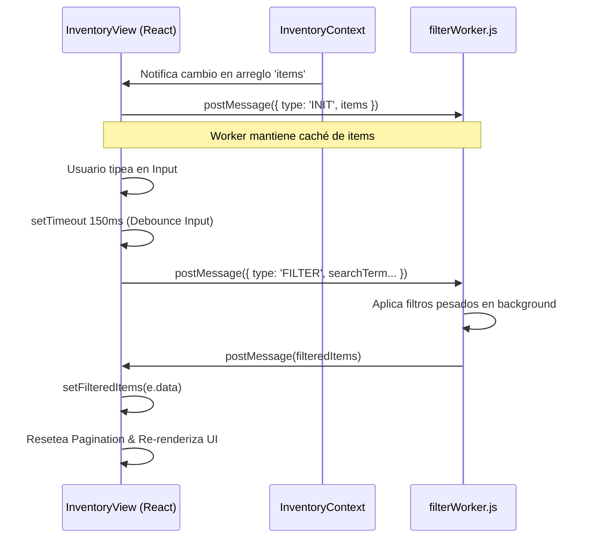

# Capítulo 19: Vista de Inventario Principal (`InventoryView.jsx`)

## Introducción

El componente `InventoryView` representa el núcleo operativo y visual de la aplicación **Inventor Manager**. Su responsabilidad principal es presentar, organizar y gestionar el catálogo completo de artículos pertenecientes a una categoría específica. 

Dada la naturaleza crítica de esta vista —la cual suele manejar un alto volumen de datos en despliegues reales—, el componente está diseñado en torno al alto rendimiento. Implementa técnicas avanzadas como la delegación de procesamiento intensivo a **Web Workers**, manejo asíncrono de eventos, renderizado paulatino mediante **Scroll Infinito (Intersection Observer)**, y una profunda gestión de estados derivados.

En este documento se desglosan a nivel arquitectónico y de código las decisiones técnicas que componen esta vista.

---

## 1. Estructura de la Vista Principal

La vista no está consolidada en un solo bloque gigantesco, sino que separa claramente la lógica de contenedores (Smart Components) de la lógica de presentación individual de los datos (Dumb Components).

### 1.1 `InventoryView`: El Componente Padre

El componente actúa como el orquestador principal. Sus áreas funcionales son:

1. **Gestión de Contextos:** Consume `InventoryContextOptimized` para acceder al estado global (ítems, personal, cargas) y operaciones CRUD, y `AuthContext` para aplicar Control de Acceso Basado en Roles (RBAC) con variables como `isAdmin`, `isStaff`, `canEditIn`.
2. **Distribución de la Interfaz:**
   - **Header de Herramientas (`tools-header`):** Contiene estadísticas, barra de búsqueda, botones globales de exportación/importación y el botón de añadir nuevo artículo.
   - **Navegador de Subcategorías:** Una cinta de botones tipo "pills" extraídos dinámicamente de los datos disponibles, permitiendo filtros rápidos horizontales.
   - **Grid de Datos (`invt-container`):** El contenedor principal tipo tabla-tarjeta.
   - **Modales Flotantes:** Colección de componentes que se sobreponen a la UI. (Ej: `ActionModal`, `TransferModal`, `MoveSectionModal`, `BulkActionModal`, etc.).
   - **Barra de Acciones Masivas (`invt-bulk-bar`):** Renderizado condicional en la parte inferior si hay múltiples elementos seleccionados.

### 1.2 `InventoryRow`: Presentación Optimizada

El subcomponente `InventoryRow` está protegido por `React.memo` para evitar reconciliaciones inútiles en el DOM. 

> [!TIP]
> Al pasar funciones por el objeto `handlers` (previamente memorizado con `useMemo` en el padre), se asegura que `InventoryRow` mantenga la misma referencia de sus callbacks entre renders, garantizando que `React.memo` funcione y evite repintados masivos al escribir en el buscador.

El componente también es responsable de calcular indicadores de criticidad basándose en el inventario actual (`item.qty`) frente al punto de reorden (`item.threshold`), generando clases CSS dinámicas (`critical`, `low`, `ok`) que renderizan barras de progreso y colores de alerta. Además, si el ítem pertenece a una "Categoría Dinámica" configurada con campos personalizados, el componente itera estos esquemas para renderizar las etiquetas (tags) dinámicas, silenciando metadatos residuales inútiles de Excel.

---

## 2. Delegación de Búsqueda al Web Worker

Al buscar sobre un array masivo de miles de artículos con expresiones regulares, el hilo principal de JavaScript (Main Thread) suele bloquearse, ocasionando caídas en los fotogramas (Frame drops) y una UI que "tartamudea". `InventoryView` delega la carga pesada a un subproceso a través de un **Web Worker**.



### 2.1 Ciclo de Vida del Web Worker
Se utiliza un `useEffect` de montaje vacío `[]` para inicializar el hilo de ejecución `new Worker(new URL('../workers/filterWorker.js', import.meta.url))` y se almacena su referencia en un `useRef` para evitar su recolección de basura. 

- **Fase `INIT`:** Cada vez que el dataset global muta (alguien añadió o borró un producto desde Firebase), un `useEffect` monitorea el cambio de `items` y envía un paquete `INIT` al worker. Esto sincroniza la "base de datos" del worker con la de React.
- **Fase `FILTER`:** Cuando se modifican los criterios de selección (búsqueda, marca, ubicación). Se envían todos los parámetros y el worker procesa asíncronamente el resultado.

### 2.2 Estrategia de Debouncing (Anti-rebote)

Se utiliza una doble capa protectora de tiempos de espera (`setTimeout`):
1. **Debounce de Entrada de Usuario (150ms):** El input directo se guarda en `searchTerm`, pero tras 150ms de inactividad se copia a `debouncedSearch`. Esto evita cálculos parciales (ej. buscar "c", "ca", "cab", "cabl" en lugar de solo "cable").
2. **Debounce de Red/Worker (50ms):** Cualquier cambio en `debouncedSearch` dispara un mini-retraso de 50ms antes de llamar a `workerRef.current.postMessage`. Si Firebase envía múltiples ráfagas de actualizaciones seguidas, se evita saturar el canal de mensajes del Worker.

---

## 3. Renderizado y Lista "Virtualizada" (Infinite Scroll)

> [!WARNING]
> En versiones anteriores se empleaba una librería de virtualización estricta (`react-window`). Sin embargo, para maximizar la compatibilidad responsiva de las tarjetas fluidas en entornos móviles, se eliminó ese enfoque a favor de un patrón de **Scroll Infinito Basado en Intersección**.

### 3.1 Mecánica del `IntersectionObserver`

En lugar de renderizar miles de nodos DOM que el usuario no está viendo (lo cual colapsaría el navegador por consumo de memoria RAM), la vista restringe la salida mediante la variable de estado `visibleCount` (iniciada en 40). 

```javascript
  const observerTarget = useCallback(node => {
    if (loading) return;
    if (observer.current) observer.current.disconnect();
    
    observer.current = new IntersectionObserver(entries => {
      if (entries[0].isIntersecting) {
        setVisibleCount(prev => prev + 40);
      }
    }, { threshold: 0.1, rootMargin: '200px' });
    
    if (node) observer.current.observe(node);
  }, [loading]);
```

- En el cuerpo de la lista, un mapeo restringe los datos: `filteredItems.slice(0, visibleCount).map(...)`.
- Se coloca un `<Loader2>` oculto al final de la lista. Este elemento lleva el ref especial `observerTarget`.
- Usando `useCallback` sobre un ref de nodo, React nos notifica el momento exacto en que el elemento `<Loader>` se adjunta o se retira del DOM.
- Cuando el usuario hace scroll hacia abajo, y el loader cruza un margen de 200 pixeles de acercamiento (`rootMargin: '200px'`), el observador dispara y suma 40 elementos más al contador.

---

## 4. Gestión de Eventos y Botones de Acción

### 4.1 Acciones Individuales de Fila
Los botones inyectados al final de cada tarjeta en `InventoryRow` llaman al objeto `handlers`. Cada acción lanza un modal con propósitos definidos:

| Icono | Modal / Acción | Descripción | Permisos Requeridos |
|---|---|---|---|
| ➔ (Flecha) | `MoveSectionModal` | Mueve un artículo hacia otra categoría distinta estructuralmente. | `isStaff` |
| ⟳ (Rotación) | `TransferModal` | Registra el tránsito de stock de la ubicación A hacia la B. | `isStaff` |
| ⚡ (Actividad)| `ActionModal` | Movimiento puro (Ingresos, bajas o retiros de stock). | `isStaff` |
| 📋 (Tabla) | `AuditModal` | Auditoría física de inventario (Conteo manual vs Sistema). | `isStaff` |
| ✏️ (Lápiz) | `AddItemModal` | Re-aprovecha el modal de creación, pero en modo Edición (`initialData`). | `isAdmin` o `canEditIn` |
| 🗑️ (Basura) | `handleDelete` | Elimina lógicamente la existencia completa del artículo (con prompt). | `isAdmin` |

### 4.2 Acciones Masivas (Bulk Actions)
Al existir casillas de verificación (checkboxes) disponibles para `isStaff`, se guarda una colección de IDs en el estado local de Set (`selectedItems`). 

Al momento en el que el tamaño de ese Set supera 0, una barra inferior aparece utilizando clases de z-index elevado (`invt-bulk-bar`). Ofrece:
1. **Sacar Lote:** Ejecuta `BulkActionModal`, permitiendo definir cantidades de extracción dispares para los N elementos seleccionados en una sola transacción unificada (Batch).
2. **Mover a Sección Lote:** Invoca `BulkMoveSectionModal`, útil para reclasificar decenas de productos (ej. cambiar 50 tipos de cables de categoría) en una sola operación.

### 4.3 Generación e Impresión de Código QR

La vista facilita la identificación de almacenes permitiendo generar Códigos QR mediante la librería `qrcode.react`.

> [!NOTE]
> El modal para QR utiliza `createPortal(..., document.body)`. Esta técnica de React permite "teletransportar" el DOM del modal directamente al `<body>`, escapando de cualquier contenedor padre que tenga directivas CSS conflictivas como `overflow: hidden` o `z-index`, garantizando que el modal siempre aparezca al frente de la app.

Cuando el usuario da clic en "Imprimir":
1. El código localiza el nodo `<svg>` en el DOM empleando `document.querySelector('#print-qr-section svg')`.
2. Se extrae su representación como texto crudo (`outerHTML`).
3. Se crea una ventana temporal (popup o iframe) mediante `window.open()`.
4. Se inyecta un documento HTML que configura márgenes de impresión a dimensiones de etiqueta térmica (`size: 65mm 35mm`), añadiendo un escape seguro de entidades HTML (anti-XSS) para prevenir ataques si el nombre del producto contenía código malicioso.
5. Se invoca automáticamente el diálogo nativo `windowPrint.print()`.

---

## Conclusión

La arquitectura de `InventoryView.jsx` no obedece a un simple mapeo de componentes React, sino a un diseño meticuloso que abraza el **Performance** y la **Escalabilidad**. A través de sus delegaciones asíncronas con Web Workers, la limitación agresiva de renderizados por `IntersectionObserver`, el blindaje de re-pintados mediante `React.memo` y `useMemo`, y sus avanzados modales multi-registro; el sistema garantiza una operación administrativa ininterrumpida frente a repositorios que albergan decenas de miles de entradas individuales.
