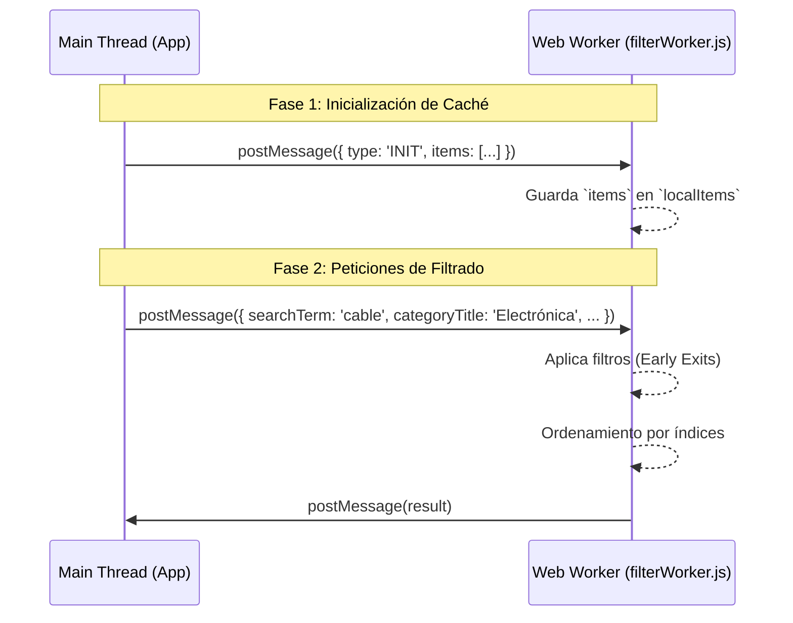

# Capítulo 23: Arquitectura y Lógica del Web Worker de Filtrado

> [!NOTE]
> Este documento ofrece un análisis minucioso del archivo `src/workers/filterWorker.js` perteneciente al proyecto Inventor Manager. El componente es una pieza clave en el rendimiento de la aplicación, pues traslada la carga computacional del filtrado y ordenamiento de elementos fuera del hilo principal de ejecución (Main Thread), garantizando una interfaz fluida incluso con grandes volúmenes de datos.

## 1. Introducción: ¿Qué, Cómo y Por Qué?

### ¿Qué hace `filterWorker.js`?
Es un Web Worker en JavaScript dedicado exclusivamente a recibir una lista maestra de inventario, aplicar múltiples criterios de filtro (categorías, marcas, ubicaciones, texto libre) y devolver un subconjunto ordenado. 

### ¿Cómo lo hace?
Escucha eventos a través de la interfaz `onmessage`. Opera en dos modalidades:
1. **Inicialización**: Recibe la totalidad de los datos y los almacena en memoria local del Worker.
2. **Filtrado**: Recibe únicamente los parámetros de búsqueda, itera sobre los datos cacheados usando estructuras clásicas de alto rendimiento (bucles `for` en lugar de métodos funcionales como `.filter` o `.map`), y ordena los resultados mediante una técnica avanzada basada en índices.

### ¿Por qué existe?
El filtrado interactivo (por ejemplo, buscar elementos a medida que el usuario teclea) exige recálculos continuos. En inventarios con miles de registros, la evaluación de 10 a 15 condiciones por registro dentro del Main Thread causaría bloqueos de la interfaz (UI freezing). Aislar esta tarea en un hilo independiente (Web Worker) preserva los 60 FPS de la aplicación y la interactividad del DOM. Además, al implementar una **caché local**, se evita la penalización de rendimiento por clonación estructurada que ocurre cuando se transfiere el array completo en cada pulsación de tecla.

---

## 2. Flujo de Datos y Arquitectura de Mensajes

El Worker se comunica con la aplicación principal a través del paso de mensajes. 



> [!IMPORTANT]
> El paso de mensajes en JavaScript utiliza el algoritmo de *Structured Clone*. Esto significa que enviar arrays masivos constantemente es costoso. La separación entre el evento `INIT` y los eventos de búsqueda es una decisión arquitectónica vital para mitigar este costo.

---

## 3. Almacenamiento en Caché Local y Manejo del Estado

El archivo comienza con una variable global al ámbito del worker:

```javascript
/**
 * Worker para filtrar el inventario.
 */
let localItems = [];
```

### Inicialización (`type === 'INIT'`)
Dentro del listener de mensajes `self.onmessage = (e) => { ... }`, la primera comprobación es:

```javascript
if (type === 'INIT') {
  localItems = items;
  return;
}
```

**Por qué**: Esta estrategia de "caché local caliente" previene la necesidad de enviar el catálogo completo con cada tecla presionada. La UI envía los datos pesados una sola vez (o cuando se actualiza el catálogo de la BD), y luego el Worker mantiene la referencia viva. 

### Defensas y Validaciones
Inmediatamente después, el Worker protege su flujo de ejecución:

```javascript
if (!localItems || !Array.isArray(localItems)) {
  self.postMessage([]);
  return;
}
```
Si el hilo principal intenta pedir un filtrado antes de que la caché se haya inicializado correctamente o si los datos llegaron corruptos, el worker retorna un array vacío, previniendo errores de tipo `TypeError` al intentar iterar.

---

## 4. Análisis Exhaustivo del Ciclo de Filtrado y Salidas Tempranas (Early Exits)

La porción más crítica en cuanto al rendimiento ocurre en el bucle principal.

```javascript
const searchLow = searchTerm ? searchTerm.toLowerCase().trim() : '';
const filtered = [];

for (let i = 0, len = localItems.length; i < len; i++) {
  const item = localItems[i];
```

> [!TIP]  
> **Optimización de Bucle For**: Observa el uso de `let i = 0, len = localItems.length`. Al almacenar la longitud en la variable `len`, se evita que el motor V8 de JavaScript tenga que evaluar la propiedad `.length` del array en cada iteración, obteniendo micro-optimizaciones que suman en grandes volúmenes. Se descartan métodos como `Array.prototype.filter` para evitar el *overhead* de llamadas a funciones de callback anónimas.

### Estrategia de Salidas Tempranas (`continue`)
El filtrado aplica una arquitectura lógica de **descarte rápido** (Early Exit). Se evalúan las condiciones de más estrictas a menos estrictas, empleando `continue` para saltar a la siguiente iteración en el instante que el ítem falla una regla.

```javascript
  // Filtros por categoría
  if (item.category !== categoryTitle) continue;
  if (activeSubcategory !== 'TODAS' && item.subcategory !== activeSubcategory) continue;
  if (selectedBrand !== 'Todas' && item.marca !== selectedBrand) continue;
```
En lugar de una única sentencia `if` gigante, la verificación escalonada es mucho más fácil de depurar y altamente performante. Si un producto no es de la categoría solicitada, el procesador aborta el análisis de ese ítem en la primera línea.

### Filtrado de Ubicaciones y Compatibilidad Hacia Atrás (Legacy Support)
```javascript
  if (selectedLocation !== 'Todas') {
    const hasStockInLoc = item.stockByLocation && item.stockByLocation[selectedLocation] > 0;
    const isLegacyLoc = item.location === selectedLocation;
    if (!hasStockInLoc && !isLegacyLoc) continue;
  }
  if (statusFilter && item.status !== statusFilter) continue;
```
Este bloque revela una evolución en el esquema de la base de datos de la aplicación:
- `isLegacyLoc`: Maneja datos antiguos donde el producto tenía una única ubicación `item.location`.
- `hasStockInLoc`: Maneja el esquema moderno donde un mismo ítem puede tener existencias distribuidas usando un mapa `stockByLocation`.
- Si el ítem no cumple con ninguna de las dos lógicas, el filtro lo descarta.

---

## 5. Búsqueda Textual y Evaluaciones Perezosas (Short-circuit Evaluation)

Si el usuario introdujo un término de búsqueda, se ejecuta la coincidencia textual.

```javascript
  // Búsqueda textual solo si hay término
  if (searchLow) {
    const match = (
      (item.name && item.name.toLowerCase().includes(searchLow)) || 
      (item.subcategory && item.subcategory.toLowerCase().includes(searchLow)) || 
      (item.category && item.category.toLowerCase().includes(searchLow)) || 
      (item.modelo && item.modelo.toLowerCase().includes(searchLow)) || 
      (item.marca && item.marca.toLowerCase().includes(searchLow)) || 
      (item.brand && item.brand.toLowerCase().includes(searchLow)) || 
      (item.codigo && item.codigo.toLowerCase().includes(searchLow)) || 
      (item.item_number && String(item.item_number).includes(searchLow)) || 
      (item.serie && item.serie.toLowerCase().includes(searchLow)) ||
      (item.observaciones && item.observaciones.toLowerCase().includes(searchLow)) ||
      (item.id && item.id.toLowerCase().includes(searchLow))
    );
    if (!match) continue;
  }
  
  filtered.push(item);
}
```

> [!NOTE]  
> **Evaluación de Cortocircuito**: En JavaScript, el operador lógico `||` detiene la evaluación tan pronto como encuentra un valor verdadero. Si el término de búsqueda coincide con `item.name`, el motor ignora por completo el resto de las comprobaciones. Es por ello que las propiedades con mayor probabilidad de coincidencia (como el nombre y la categoría) se colocan primero.

Cabe destacar el uso defensivo de la existencia de propiedades: `(item.name && item.name...)`. Esto evita excepciones de tipo *Cannot read properties of undefined* si un registro en la base de datos carece de algún campo. Además, nótese la coerción explícita a cadena con `String(item.item_number)` para proteger el uso de `.includes()` en valores que originalmente podrían ser numéricos.

---

## 6. Algoritmo de Ordenamiento Avanzado Basado en Índices

Una vez filtrados los datos, el requerimiento es devolverlos ordenados alfabéticamente por su nombre. Ordenar un array masivo de objetos en JavaScript tiene un problema inherente: el método `Array.prototype.sort()` pasa iterativamente dos objetos `(a, b)` a la función comparadora, la cual extrae propiedades complejas de ambos objetos constantemente, causando un impacto en la caché de la CPU y excesivos *property lookups*.

El autor implementó una solución brillante: **Index-Based Sorting**.

### Paso A: Extracción de Claves
```javascript
const len = filtered.length;
const keys = new Array(len);
for (let i = 0; i < len; i++) {
  keys[i] = (filtered[i].name || '').trim().toLowerCase();
}
```
Se pre-asigna un array `keys` con el tamaño exacto del resultado (`new Array(len)` es considerablemente más rápido que `.push()` continuo en memoria). Aquí se normaliza el nombre a ordenar una sola vez por objeto.

### Paso B: Creación y Ordenamiento de Índices
```javascript
// Crear array de índices y ordenar por clave
const indices = new Array(len);
for (let i = 0; i < len; i++) indices[i] = i;

indices.sort((a, b) => {
  if (keys[a] < keys[b]) return -1;
  if (keys[a] > keys[b]) return 1;
  return 0;
});
```
En lugar de mover objetos completos pesados, se crea un array simple de enteros del `0` a `len - 1` (`[0, 1, 2, ...]`). El algoritmo de ordenación opera **únicamente sobre los enteros**, usando las variables primitivas `a` y `b` como punteros para buscar en el array de `keys` cacheados.

### Paso C: Construcción del Resultado
```javascript
// Construir resultado ordenado (sin campos internos de Worker)
const result = new Array(len);
for (let i = 0; i < len; i++) {
  result[i] = filtered[indices[i]];
}
```
Se genera el array final mapeando los objetos en memoria según los índices que ya han sido ordenados. Esta técnica (conocida como *Schwartzian transform* o clasificación decorada) reduce drásticamente el tiempo de ejecución en conjuntos de datos grandes.

---

## 7. Retorno de Resultados y Gestión de Hilos

```javascript
self.postMessage(result);
```
El arreglo final `result` es enviado de regreso al hilo principal. Al haberse ejecutado todas estas operaciones intensivas —cientos de miles de comprobaciones de strings, comparaciones booleanas, y rutinas de ordenamiento de arrays— en el *background thread*, la aplicación web en el *Main Thread* (encargada de renderizar React/DOM, recibir clicks, y mostrar animaciones) permanece intacta, respondiendo de inmediato al usuario, e inyectando los datos en la vista únicamente cuando el Web Worker finaliza su labor.

## 8. Conclusiones y Consideraciones de Diseño

### Ventajas de este enfoque:
1. **Desacoplamiento de UI y Lógica**: Garantiza que ningún dispositivo experimente lentitud visual (jank), incluso en móviles de gama baja donde procesar miles de cadenas bloquea el hilo principal severamente.
2. **Eficiencia Algorítmica (O(N))**: La reducción de bucles anidados e iteraciones secundarias garantiza que el filtrado pase por los datos en una sola barrida perimetral.
3. **Gestión Defensiva**: La inicialización separada previene el colapso de memoria provocado por serializar bases de datos enteras a través del puente de mensajería `Worker-Host` repetidas veces.
4. **Retrocompatibilidad**: Tolera múltiples generaciones de esquema de bases de datos mediante los condicionales híbridos de *Location*.

Este Worker es un ejemplo modélico de alto rendimiento en interfaces de aplicaciones enriquecidas, fusionando arquitecturas concurrentes simples con micro-optimizaciones imperativas.
