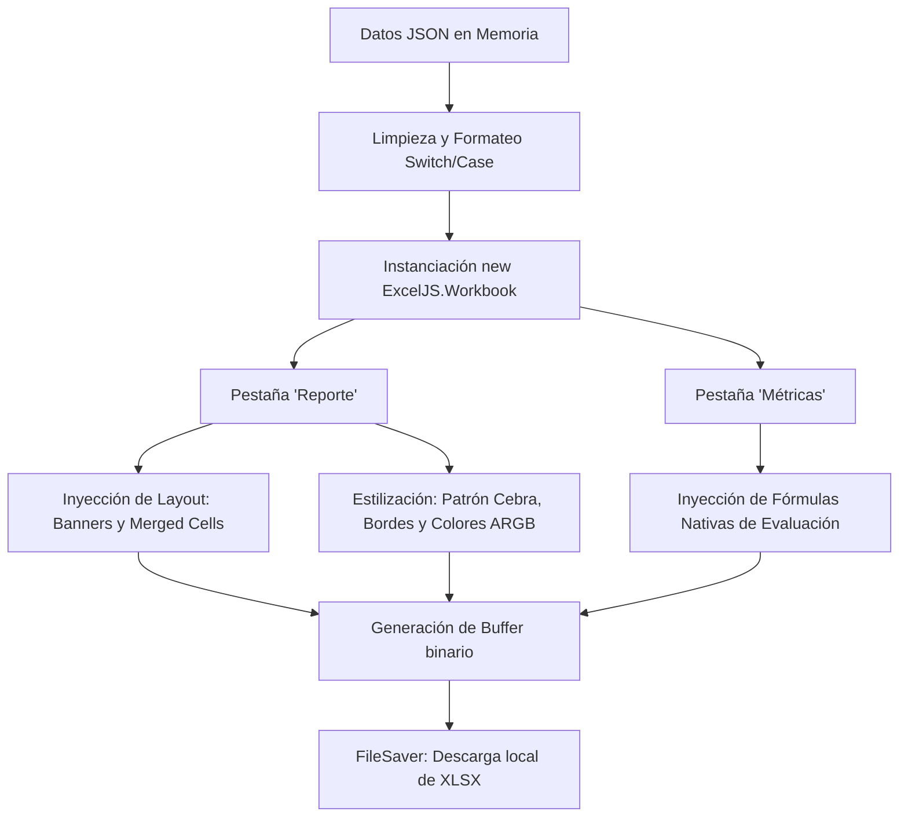

# Capítulo 25: Exportación Avanzada a Excel con ExcelJS y Fórmulas Nativas

El módulo `src/utils/exportUtils.js` es la piedra angular del sistema de reportes de **Inventor Manager**. Su propósito es transformar los datos en formato JSON provenientes del estado de la aplicación en documentos de Excel (`.xlsx`) completamente funcionales, estilizados y con capacidades analíticas integradas. 

A diferencia de una simple exportación CSV (que el módulo también soporta como método de contingencia), el uso de la biblioteca **ExcelJS** permite la inyección de estilos complejos (colores, bordes), estructuras multipestaña y, más importante aún, **fórmulas nativas de Excel** que se evalúan automáticamente al abrir el archivo.

---

## 25.1. Arquitectura y Dependencias del Módulo

El flujo de exportación ocurre íntegramente en el lado del cliente (navegador), lo que reduce la carga computacional en el servidor y permite una descarga inmediata del archivo.

```javascript
import ExcelJS from 'exceljs';
import { saveAs } from 'file-saver';
```

- **ExcelJS**: Es un motor completo para leer, manipular y escribir hojas de cálculo XLSX. Soporta el estándar OOXML (Office Open XML).
- **FileSaver.js**: Proporciona la funcionalidad `saveAs`, que permite tomar un bloque binario de datos en la memoria del navegador (`Blob`) y disparar la ventana de "Guardar como..." nativa del sistema operativo.

> [!NOTE]
> Al procesar el archivo del lado del cliente, es vital considerar la optimización del código. Iterar sobre miles de filas e inyectar estilos celda por celda puede afectar el hilo principal (Main Thread) de la interfaz de usuario en bases de datos masivas.

### Diagrama de Flujo de Exportación



---

## 25.2. Diseño de Interfaz en Excel (Layout y Banners)

Una de las características más destacadas del código es su atención al diseño del reporte. No se trata simplemente de una tabla plana. La función `exportToExcel` utiliza la API de manipulación de celdas y filas para construir "Banners" en la parte superior del documento.

### Fusión de Celdas y Dimensiones

Para crear espacios visualmente atractivos en la parte superior, se reserva el área superior fusionando celdas con el método `mergeCells`.

```javascript
// Aumentar altura de la primera fila
worksheet.getRow(1).height = 40;

// Banner Negro Superior (Botón Simulado)
worksheet.mergeCells('A1:H4'); 

// Banner de Categoría Naranja
worksheet.mergeCells('A5:C7');
```

El uso de `mergeCells('Rango')` elimina la división de las celdas en ese bloque, tratándolas como una macro-celda (accesible a través de la celda superior izquierda del rango, por ejemplo, `A1` o `A5`).

### Inyección de Colores ARGB

En ExcelJS, los colores se configuran bajo el modelo **ARGB** (Alpha, Red, Green, Blue). Los primeros dos caracteres hexadecimales representan la opacidad, siendo `FF` opaco al 100%.

> [!WARNING]
> Si defines un color como `000000` omitiendo el canal Alpha, ExcelJS y Microsoft Excel lo interpretarán como 100% transparente, resultando en que el color no se renderice. Siempre usa el prefijo `FF`.

| Elemento Visual | Código ARGB | Descripción del Color | Uso en el Reporte |
| --- | --- | --- | --- |
| Banner Superior | `FF000000` | Negro Sólido | Fondo de la sección "REPORTE GENERADO" |
| Texto de Banner | `FFFFFFFF` | Blanco Puro | Letras del título y encabezados de tabla |
| Título Categoría | `FFE67E22` | Naranja Intenso | Fondo del banner de categoría |
| Efecto Cebra | `FFFFF3E0` | Naranja/Crema | Fondo alterno para las filas de datos |
| Bordes de Tabla | `FFCC6600` | Naranja Oscuro | Líneas separadoras del grid principal |
| Alerta Crítica | `FFFF0000` | Rojo Brillante | Texto de estados "CRITICO", "BAJO" |
| Header Métricas | `FF005432` | Verde Oscuro | Fondo de la cabecera del Dashboard |

Para aplicar un relleno sólido a una celda, se requiere el objeto `fill`:
```javascript
catBanner.fill = { 
  type: 'pattern', 
  pattern: 'solid', 
  fgColor: { argb: 'FFE67E22' } 
};
```

---

## 25.3. Dinamismo de Datos y Estilización por Fila

El bloque central de la función se encarga de formatear el `array` de datos crudos según la categoría y de escribirlos en la tabla. 

### Inserción de Tabla y Patrón Cebra (Zebra Striping)

Después de definir las columnas y el `startRow = 9` (lo que asegura que la tabla inicie debajo de los banners de título), el algoritmo itera sobre los datos e inyecta la configuración visual por fila y celda.

```javascript
cleanData.forEach((item, index) => {
  const row = worksheet.addRow(item);
  row.height = 22;
  
  // Efecto Zebra
  if (index % 2 === 0) {
    row.fill = { type: 'pattern', pattern: 'solid', fgColor: { argb: 'FFFFF3E0' } };
  }
```

El operador de módulo `index % 2 === 0` garantiza que cada fila par reciba un color de fondo ligeramente tintado, mejorando la legibilidad lateral en tablas anchas, tal y como dictan los estándares de UI/UX para tablas de datos.

### Bordes Perimetrales e Internos

La delineación de las celdas no confía en el grid genérico de Excel. El sistema dibuja bordes explícitos con un estilo de línea particular:

```javascript
cell.border = {
  top: { style: 'thin', color: { argb: 'FFCC6600' } },
  left: { style: 'thin', color: { argb: 'FFCC6600' } },
  bottom: { style: 'thin', color: { argb: 'FFCC6600' } },
  right: { style: 'thin', color: { argb: 'FFCC6600' } }
};
```
Cada lado de la celda puede ser estilizado con grosores diferentes (`thin`, `medium`, `thick`). Aquí se aplica un color naranja oscuro unificado que mantiene la identidad corporativa/visual del reporte.

### Formato Condicional Estático

El archivo evalúa el valor textual de la celda y altera la fuente de inmediato, evitando usar las complejas reglas internas de evaluación XML condicional de Excel:

```javascript
if (cell.value === 'CRITICO' || cell.value === 'BAJO' || cell.value === 'Agotado') {
  cell.font = { color: { argb: 'FFFF0000' }, bold: true }; // Rojo Brillante + Negrita
}
```

---

## 25.4. Inyección de Fórmulas Nativas de Excel (Dashboard)

Uno de los aportes más avanzados de este script es la creación de una segunda hoja (`addWorksheet('Métricas')`) que actúa como un **Dashboard analítico automatizado**. En lugar de calcular el resumen en JavaScript y pegar el número estático, el código inyecta fórmulas nativas. Esto permite que, si el usuario modifica los datos en la hoja "Reporte", el Dashboard se actualice automáticamente en Excel.

### La Mecánica de inyección de Objeto `{ formula }`

En ExcelJS, si pasas un simple String como `"=COUNTIF(...)"`, Excel no lo evaluará como fórmula automáticamente, sino que lo verá como texto hasta que el usuario de doble clic y pulse Enter. 
Para resolver esto, ExcelJS soporta la inyección de **objetos de celda complejos**:

```javascript
const totalRows = cleanData.length;

dashSheet.addRows([
  ['Total de Artículos', totalRows],
  ['Artículos en Crítico', { formula: `COUNTIF(Reporte!F${startRow + 1}:F${startRow + totalRows}, "CRITICO")` }],
  ['Artículos con Stock Bajo', { formula: `COUNTIF(Reporte!F${startRow + 1}:F${startRow + totalRows}, "BAJO")` }],
  ['% Disponibilidad', { formula: `(COUNTIF(Reporte!F${startRow + 1}:F${startRow + totalRows}, "OK") / ${totalRows})` }]
]);
```

> [!TIP]
> **Cálculo de Rango Dinámico**:
> Nota cómo el rango de la fórmula `F${startRow + 1}:F${startRow + totalRows}` se genera dinámicamente:
> - `startRow` es `9` (Cabeceras).
> - Los datos comienzan en `startRow + 1` (Fila 10).
> - Terminan en la fila `10 + totalRows - 1`. 
> Al evaluar la literal de plantilla, si tenemos 50 registros, se escribe una fórmula perfecta en Excel: `=COUNTIF(Reporte!F10:F59, "CRITICO")`.

### Formato Numérico Personalizado (numFmt)

Cuando una fórmula (como la de *% Disponibilidad*) resulta en una fracción (e.g. `0.85`), es vital mostrarla como un porcentaje legible para un humano, sin alterar el valor matemático en el libro. 

```javascript
dashSheet.getCell('B6').numFmt = '0.00%';
```
Esta propiedad (`numFmt`) aplica el formato numérico interno de Excel, convirtiendo matemáticamente `0.85` en `85.00%` en la vista de usuario.

---

## 25.5. Exportaciones Multi-Libro

Además de `exportToExcel`, el módulo expone `exportFullDatabase`, una herramienta diseñada para hacer un vaciado estructural de toda la base de datos de manera segmentada.

```javascript
export const exportFullDatabase = async (items) => {
  // 1. Obtener lista única de categorías
  const categories = [...new Set(items.map(i => i.category))];

  // 2. Iterar sobre cada categoría para crear una pestaña dedicada
  for (const cat of categories) {
    const catItems = items.filter(i => i.category === cat);
    const sheet = workbook.addWorksheet(cat.substring(0, 30));
    // ... inserción de datos
  }
}
```

> [!IMPORTANT]
> El uso de `substring(0, 30)` al crear el Worksheet (`addWorksheet`) es una medida defensiva obligatoria. El estándar de archivos Excel (XLSX) limita **estrictamente** los nombres de las hojas (pestañas) a 31 caracteres. Si una categoría de base de datos excede este límite, el archivo final se corromperá.

---

## 25.6. Compilación del Buffer y Descarga

El ciclo de vida de la exportación concluye con la conversión de la estructura de objetos (Workbook) en un flujo binario compatible con XLSX.

```javascript
// 1. Escritura del documento binario a memoria asíncronamente
const finalBuffer = await workbook.xlsx.writeBuffer();

// 2. Creación del objeto Blob (Archivo binario del navegador)
const blob = new Blob([finalBuffer]);

// 3. Descarga al sistema operativo usando FileSaver
saveAs(blob, `${filename}.xlsx`);
```

Al utilizar `Blob`, encapsulamos los bytes (Buffer) en un objeto que el navegador interpreta como un archivo físico. La biblioteca `file-saver` luego invoca las APIs nativas del navegador (similar a la creación temporal de un elemento `<a>` con `href` y atributo `download`) para guardar el reporte en la carpeta local de descargas del usuario de manera limpia y sin fricciones.

### Resumen de Buenas Prácticas Aplicadas en este Módulo:
1. **Separación de Responsabilidades**: Todo el mapeo de formato (`cleanData.map`) ocurre antes de tocar la API de Excel, facilitando mantenimiento.
2. **Defensividad de Tipos**: Las fechas de Firestore (`item.loanDate`) son tratadas previendo casos en los que sean Timestamps (con el método `.toDate()`) o números de época planos, garantizando que el reporte no falle (crash).
3. **Escalabilidad Visual**: La lógica del reporte asume que la cantidad de filas puede variar, y utiliza variables relativas (`startRow`, `totalRows`) para atar los cálculos y rangos sin codificar duramente (hardcoding) los números en las fórmulas.
