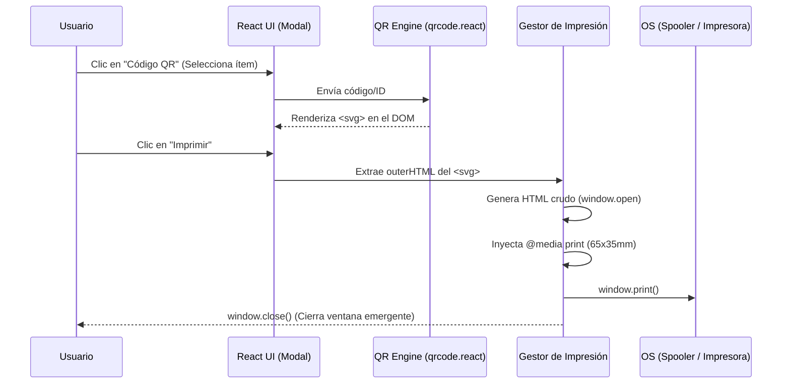

# Capítulo 27: Impresión Térmica y Generación de Códigos QR

El sistema Inventor Manager requiere una solución robusta y ágil para la generación de etiquetas de inventario y herramientas, permitiendo el control y rastreo del equipo físico mediante códigos QR. Este capítulo desglosa de manera exhaustiva la funcionalidad de impresión de etiquetas implementada en los componentes `src/views/InventoryView.jsx` y `src/views/ToolsView.jsx`.

Se analizará el ciclo de vida completo de la funcionalidad: desde la generación vectorial del código QR, la extracción del DOM, hasta la inyección en un entorno aislado (`window.open`) y la aplicación estricta de directivas CSS (`@media print`) diseñadas específicamente para impresoras térmicas como Zebra o Bixolon.

---

## 1. Arquitectura de Impresión a Alto Nivel

El entorno de una aplicación React de una sola página (SPA) presenta desafíos considerables al intentar imprimir fragmentos específicos de la interfaz. Los estilos globales, el comportamiento responsivo y los márgenes predeterminados del navegador complican el control a nivel milimétrico requerido por las impresoras de etiquetas.

Para resolver esto, Inventor Manager opta por una **arquitectura de impresión por ventana aislada**. En lugar de intentar imprimir el DOM de React ocultando elementos con CSS, el sistema extrae únicamente los datos vectoriales del QR generado y construye un documento HTML plano y limpio al vuelo. 

### Diagrama del Flujo de Datos



---

## 2. Generación del Código QR Vectorial

El ecosistema utiliza la librería `qrcode.react`, específicamente el componente `QRCodeSVG`. La elección de generar un SVG en lugar de un Canvas es intencionada: los gráficos vectoriales aseguran que el código bidimensional mantenga una nitidez perfecta sin importar la densidad de puntos por pulgada (DPI) de la impresora térmica, evitando el desenfoque por rasterización.

### Implementación del Componente en el Modal

El QR se renderiza visualmente dentro del modal para que el usuario pueda validarlo o escanearlo desde la pantalla, y sirve como el origen de datos para la impresión.

```jsx
<div className="qr-large-wrapper" id="print-qr-section">
  <QRCodeSVG 
    value={selectedItem.code || selectedItem.codigo || selectedItem.id} 
    size={200} 
    level="H" 
    includeMargin={true} 
  />
  <p className="mt-4 font-bold text-gray-800 text-lg">{selectedItem.name}</p>
  <p className="text-gray-500 font-mono">{selectedItem.code || selectedItem.codigo || selectedItem.id}</p>
</div>
```

**Análisis de Atributos:**
- **`value`**: Es el payload del QR. Para asegurar integridad, aplica una técnica de cascada (Fallback). Intenta primero usar el identificador lógico asignado (`code` en Inventario, `codigo` en Herramientas), y si no existe, utiliza directamente el UID del documento en Firestore (`id`).
- **`size={200}`**: Define un tamaño de renderizado en pantalla (en píxeles). No afecta la impresión porque, al ser SVG, se escalará dinámicamente mediante CSS más adelante.
- **`level="H"`**: Define el nivel de corrección de errores (High). Permite que hasta el 30% del QR sufra daños (rayaduras en el papel térmico, mala impresión) sin perder legibilidad.
- **`id="print-qr-section"`**: Es el "ancla" crítica en el DOM. A través de este ID, el gestor de impresión extraerá posteriormente el `<svg>` generado.

---

## 3. Aislamiento y Preparación del Entorno de Impresión

El momento central de la arquitectura ocurre cuando el usuario presiona el botón "Imprimir". 

### Extracción del DOM
Primero, se debe recuperar el código generado por la librería.

```javascript
const svgElement = document.querySelector('#print-qr-section svg');
const svgOuter = svgElement ? svgElement.outerHTML : '';
```
Al tomar el `outerHTML`, el sistema captura la estructura vectorial pura y se desvincula totalmente del entorno reactivo, lo que permite pasar ese bloque de marcado a un entorno estático.

### Apertura de Ventana y Sanitización
Se inicializa una ventana en blanco, desprovista de cualquier regla CSS que pueda interferir:

```javascript
const windowPrint = window.open('', '', 'width=800,height=600');
```

Antes de inyectar variables en el nuevo documento HTML, es imperativo aplicar **sanitización estricta**. Al no contar con el motor de renderizado de React (que sanitiza JSX automáticamente) para esta ventana inyectada, una cadena maliciosa o mal formada en los datos del ítem (como unas comillas en un modelo) corrompería el HTML o provocaría vulnerabilidades XSS.

```javascript
const escapeHTML = (str) => {
  if (!str) return '';
  return String(str).replace(/[&<>'"]/g, 
    tag => ({
      '&': '&amp;',
      '<': '&lt;',
      '>': '&gt;',
      "'": '&#39;',
      '"': '&quot;'
    }[tag] || tag)
  );
};
```

---

## 4. Ingeniería CSS para Impresoras Térmicas

Las impresoras de etiquetas (como Zebra GC420t, ZD421, o Bixolon SLP-TX400) utilizan controladores (drivers) que extraen la información directamente del Spooler de Windows. Si el navegador no define claramente los límites físicos y los márgenes, el driver asume un tamaño Carta (A4), lo que provoca saltos de página infinitos y etiquetas en blanco.

El script genera dinámicamente el siguiente documento HTML en `windowPrint.document.write(...)`.

### Reglas para Visualización en Pantalla (Vista Previa)
Se definen reglas que muestran un "simulador" de la etiqueta en el centro de la ventana emergente, con un marco gris. Esto es útil para desarrollo y depuración si el usuario decide cancelar la impresión.

```css
body { 
  margin: 0; padding: 20px; font-family: system-ui, -apple-system, sans-serif; 
  display: flex; justify-content: center; background: #f0f0f0; 
}
.label-box { 
  width: 65mm; height: 35mm; /* Tamaño físico objetivo */
  background: #fff; border: 1px dashed #ccc; padding: 2mm 3mm; 
  box-sizing: border-box; display: flex; flex-direction: row; 
  align-items: center; gap: 3mm; color: #000; 
}
```

### La Directiva `@media print`
Esta es la sección más crítica del código. Entra en vigor exclusivamente cuando el navegador invoca al subsistema de impresión.

```css
@media print { 
  @page { 
    margin: 0; 
    size: 65mm 35mm; 
  } 
  body { 
    padding: 0; background: none; display: block; 
  } 
  .label-box { 
    border: none; width: 100%; height: 100%; page-break-inside: avoid; 
  } 
}
```

> [!IMPORTANT]
> **El papel de `@page`:**
> `margin: 0` elimina los encabezados y pies de página (URL, fecha) que los navegadores añaden por defecto.
> `size: 65mm 35mm` le indica explícitamente al controlador de la impresora el tamaño de soporte exacto (Label Roll). Sin esta instrucción, el documento generaría un desbordamiento masivo.
> **Comportamiento del contenedor:**
> La clase `.label-box` recibe `width: 100%; height: 100%;` dentro de `@media print`, lo que obliga al diseño Flexbox a ajustarse perfectamente a la geometría de la etiqueta física, eliminando el borde interlineado de depuración. `page-break-inside: avoid;` previene cortaduras a la mitad de un rollo.

### Estructura y Limitación de Contenidos

El espacio en una etiqueta de 65x35mm es un recurso escaso. El marcado define una rejilla Flexbox horizontal, donde el SVG (Código QR) está fijo a la izquierda (28x28mm) y los datos de texto se ubican a la derecha.

```css
.qr-wrapper svg { width: 28mm; height: 28mm; display: block; }

.title { 
  font-size: 9pt; font-weight: bold; margin: 0 0 3px 0; line-height: 1.1; 
  display: -webkit-box; -webkit-line-clamp: 3; -webkit-box-orient: vertical; overflow: hidden; 
}
.model { 
  font-size: 7pt; color: #666; margin: 0 0 4px 0; white-space: nowrap; 
  overflow: hidden; text-overflow: ellipsis; 
}
```

> [!TIP]
> **Gestión de desbordamiento (Overflow Management):**
> Dado que la longitud de un nombre de artículo (ej. "Taladro Percutor DeWALT 20V Max XR Brushless") puede destruir el diseño impreso, se emplean dos técnicas vitales de CSS avanzado:
> 1. Para títulos largos (`.title`), se utiliza `-webkit-line-clamp: 3`, limitando el texto a un máximo absoluto de 3 líneas y terminando con puntos suspensivos ("...").
> 2. Para datos secundarios como el modelo (`.model`), se utiliza `white-space: nowrap; text-overflow: ellipsis;` para mantenerlo estrictamente en 1 sola línea.

---

## 6. Ciclo de Ejecución de la Impresión

Una vez que el DOM de la nueva ventana ha sido construido con `document.write()`, se debe ejecutar un proceso de cierre controlado para maximizar la Experiencia de Usuario (UX).

```javascript
windowPrint.document.close();
windowPrint.focus();
setTimeout(() => {
  windowPrint.print();
  windowPrint.close();
}, 250);
```

### Justificación del Proceso:
1. **`document.close()`**: Indica al navegador web que el stream de escritura HTML ha finalizado, forzando la evaluación de las reglas CSS inyectadas y activando el layout del DOM.
2. **`focus()`**: Trae la ventana emergente al frente del OS. Es requerido por algunos navegadores por seguridad antes de permitir lanzar un diálogo de impresión automatizado.
3. **`setTimeout (250ms)`**: Este micro-retraso es fundamental. Si se llama a `window.print()` de manera síncrona inmediata, existe un alto riesgo de que el navegador capture la imagen para el Spooler antes de que el motor de renderizado haya terminado de procesar los nodos SVG o de calcular el layout Flexbox, resultando en etiquetas en blanco.
4. **`window.print() / window.close()`**: Bloquea el hilo abriendo el cuadro de diálogo de impresión del sistema. Tras que el usuario finalice el proceso (dando a "Imprimir" o "Cancelar" en el diálogo del sistema), el código continúa asíncronamente cerrando la pestaña emergente y devolviendo al usuario al inventario fluidamente.

---

## 7. Conclusión de Arquitectura

El diseño elegido provee las siguientes ventajas fundamentales a Inventor Manager:
- **Zero-Dependency a nivel servidor:** No se requieren librerías de backend (como PDFKit) ni controladores de CUPS/Spoolers. Todo ocurre del lado del cliente aprovechando las APIs estándar web.
- **Portabilidad Universal:** Funciona sin importar el OS del cliente, delegando la capa física al estándar `@media print` de CSS3, el cual es respetado por los controladores Windows/macOS.
- **Aislamiento Total:** El código en `InventoryView.jsx` y `ToolsView.jsx` garantiza que un error en el layout del resto del sistema no afectará jamás la impresión de las etiquetas térmicas.
