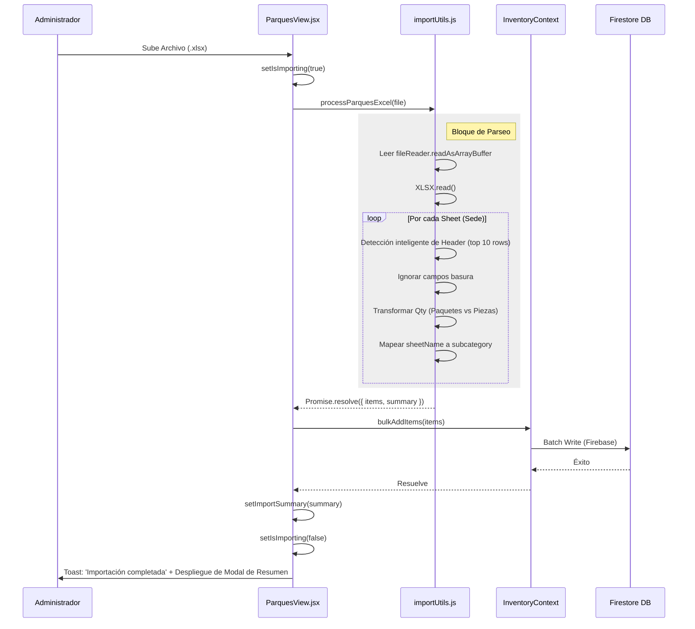

# Capítulo 29: Lógica de Parques (Multi-Sede) y Parseo Dinámico de Excel

## 1. Introducción y Arquitectura General

El módulo de **Parques** dentro de la aplicación Inventor Manager extiende la lógica base de gestión de inventarios para introducir un esquema de control distribuido (Multi-Sede). Su objetivo principal es permitir la administración independiente de los suministros e insumos correspondientes a distintas ubicaciones físicas (parques, sucursales o áreas corporativas), consolidando todo dentro de una misma interfaz unificada.

A nivel de arquitectura de datos, en lugar de diseñar colecciones separadas en la base de datos de Firestore para cada ubicación, el sistema adopta una estrategia de **"Abuso de Entidad Controlado"**. Los artículos se almacenan en la colección maestra de inventario marcados con el campo `category = 'Parques'`, y se utiliza el campo **`subcategory`** como el identificador lógico de la **Sede** u hoja de pertenencia. 

Esta abstracción permite:
- Reutilizar las funciones transaccionales centrales (`addItem`, `updateStock`, `bulkAddItems`).
- Simplificar las exportaciones y la generación de reportes corporativos.
- Importar y clasificar masivamente datos desde libros de Excel donde cada hoja de cálculo representa una sede distinta.

---

## 2. Componente de Vista: `ParquesView.jsx`

El archivo `src/views/ParquesView.jsx` orquesta la interfaz principal para los administradores y el personal en los parques. Su diseño da prioridad al rendimiento y a la tolerancia a grandes volúmenes de registros.

### 2.1. Gestión del Estado Multi-Sede (Tabs Dinámicos)

Para visualizar las diferentes sedes, el componente extrae dinámicamente un arreglo de pestañas analizando los datos alojados en memoria.

```javascript
const subcategories = useMemo(() => {
  const parks = items.filter(i => i.category === 'Parques');
  return ['TODAS', ...new Set(parks.map(i => i.subcategory || 'Sin Sede'))];
}, [items]);
```

> [!NOTE]
> Al extraer de forma reactiva las sedes usando un `Set`, el sistema se adapta automáticamente cuando un administrador añade una nueva sede a través de la interfaz (o mediante importación Excel), eliminando la necesidad de contar con tablas estáticas de catálogos de sucursales.

### 2.2. Manejo de Renderizado y Desempeño

El módulo maneja una gran cantidad de filas renderizadas utilizando una técnica combinada de delegación de búsqueda a un Web Worker y un `IntersectionObserver` nativo.

1. **Búsqueda No Bloqueante**: La caja de texto alimenta un Web Worker (`filterWorker.js`) con la palabra buscada, los ítems y los filtros de la pestaña actual. El cálculo de coincidencias ocurre fuera del hilo principal (*main thread*), regresando un array `filteredItems`.
2. **Paginación Infinita Optimizada**: Se emplea un `IntersectionObserver` para mostrar elementos progresivamente en lotes de 40 (`visibleCount`). Cuando el usuario hace *scroll* y el elemento `observerTarget` entra en la ventana de visualización, el sistema expone 40 nodos más del DOM.

```javascript
useEffect(() => {
  const observer = new IntersectionObserver(
    (entries) => {
      if (entries[0].isIntersecting) {
        setVisibleCount(prev => Math.min(prev + 40, filteredItems.length));
      }
    },
    { threshold: 0.1, rootMargin: '200px' }
  );
  if (observerTarget.current) observer.observe(observerTarget.current);
  return () => observer.disconnect();
}, [filteredItems.length]);
```

> [!TIP]
> En la línea 17 se comenta: *Eliminada virtualización compleja para máxima compatibilidad*. El uso de un `IntersectionObserver` manual garantiza una perfecta accesibilidad y renderizado móvil, evitando los errores de cálculo de altura de celdas dinámicas típicos de librerías de virtualización.

---

## 3. Parseo Avanzado y Dinámico de Excel Multi-Hoja

El corazón operativo de la sincronización de sedes reside en `src/utils/importUtils.js`, concretamente en el método `processParquesExcel`. Este método permite cargar un único archivo Excel con docenas de hojas y transformar cada hoja en un set de registros mapeados a una sede (`subcategory`) específica.

### 3.1. Iteración de Estructura Multi-Hoja

A través del objeto `FileReader` y la librería `xlsx`, se procesa el binario localmente, aislando y mapeando los encabezados por hoja:

```javascript
const workbook = XLSX.read(data, { type: 'array' });
workbook.SheetNames.forEach(sheetName => {
  const worksheet = workbook.Sheets[sheetName];
  const jsonData = XLSX.utils.sheet_to_json(worksheet, { defval: '', header: 1 });
  //...
```

La lectura con `header: 1` retorna los datos crudos en un arreglo 2D de celdas, ignorando cualquier presunción de que la primera línea de la hoja es el encabezado de las tablas.

### 3.2. Detección Inteligente de Encabezados (Smart Header Discovery)

Un problema común en los Excel proveídos por usuarios de negocio es la inclusión de "Metadatos" (títulos, logos, o nombres del reporte) en las primeras filas. El sistema iterará sobre las primeras 10 filas hasta hallar coincidencias con el léxico esperado usando heurísticas.

```javascript
// Palabras clave para buscar el encabezado
const parkKeywords = ['PAQUETE', 'PRESENTACION', 'PIEZAS', 'CANTIDAD', 'NO.'];
let headerRowIndex = -1;
let colMap = { name: 0, paquete: -1, presentacion: -1, piezas: -1 };

for (let i = 0; i < Math.min(jsonData.length, 10); i++) {
  const row = jsonData[i];
  if (!row) continue;

  const foundHeaders = row.filter(cell =>
    cell && parkKeywords.includes(String(cell).trim().toUpperCase())
  );

  if (foundHeaders.length >= 1) {
    headerRowIndex = i;
    // Mapeo dinámico de la coordenada de las columnas (colIdx) a los tokens
    break;
  }
}
```

> [!IMPORTANT]
> Esta detección asegura que si el archivo de una sede tiene el reporte tabulado iniciando en la fila 5 y otra lo tiene en la fila 1, el parseo no fallará. De no hallar coincidencias, se activa un *fallback* inteligente que asume que la segunda fila es el encabezado (`headerRowIndex = 1`).

### 3.3. Algoritmo de Saneamiento y Limpieza de Filas

Una vez mapeados los índices de columna, la iteración del contenido salta las filas con "ruido", como subtotales, totales vacíos, descripciones, o filas donde el artículo es en sí el título de la sede:

```javascript
// Saltar si el nombre está vacío, es el título repetido o es un "Total"
if (!name || String(name).trim() === '' || 
    String(name).trim().toUpperCase() === sheetName.toUpperCase() ||
    String(name).trim().toLowerCase() === 'total' ||
    String(name).trim().toLowerCase() === 'descripción') continue;
```

---

## 4. Transformación de Unidades y Cantidades (Lógica de Empaquetado)

La aplicación maneja artículos físicos que llegan a granel o empaquetados. En la hoja de Excel, los campos esperados capturan las dinámicas de recepción en almacén:
- **`PAQUETE`**: Cantidad de "Paquetes" físicos recibidos.
- **`PRESENTACION`**: Unidades individuales contenidas en cada paquete.
- **`PIEZAS`**: En caso de no ser empaquetado, la cantidad suelta de ítems.

El motor realiza una consolidación para estandarizar el registro a ingresar en la base de datos:

```javascript
let finalQty = 0;
let finalPPU = 1;
let finalUnit = 'Piezas';

if (paqueteValue > 0) {
  // Manejo a granel
  finalQty = paqueteValue;
  finalPPU = presentacionValue || 1;
  finalUnit = 'Paquetes';
} else {
  // Manejo de unidades sueltas
  finalQty = piezasValue || 0;
  finalPPU = 1;
  finalUnit = 'Piezas';
}

allItems.push({
  name: String(name).trim(),
  category: 'Parques',
  subcategory: sheetName.trim(), // Asignación Mágica a Sede
  paquete: paqueteValue || 0,
  presentacion: presentacionValue || 0,
  qty: finalQty,
  unit: finalUnit,
  pieces_per_unit: finalPPU,
  threshold: 1, // Umbral genérico que previene críticos
  costo_unitario: 0
});
```

> [!WARNING]
> Cuando se procesa como "Paquetes", la variable de stock real para control interno sigue siendo interpretada a través de `qty` y `unit`. La presentación solo se guarda como una métrica informativa (ej. "Tornillos - 2 Paquetes [50 unidades c/u]").

---

## 5. Diagrama de Flujo del Proceso

El siguiente flujo detalla las operaciones síncronas y asíncronas desde que el usuario escoge el archivo de su sistema de archivos.



---

## 6. Retroalimentación Visual de la Importación

Un elemento fundamental es la transparencia post-operación. Para libros de Excel masivos, si la importación falla o lee menos datos de los esperados, el administrador debe saber exactamente por qué hoja ocurrió el error. 

El objeto `summary` devuelto por el procesador de Excel es utilizado por la vista para renderizar un modal de resumen:

```javascript
{importSummary && (
  <div className="modal-overlay">
    <div className="modal-card animate-scale-up max-w-lg">
      <header className="modal-header">
        <h3>Resumen de Importación</h3>
      </header>
      <div className="space-y-3 max-h-60 overflow-y-auto pr-2">
        {importSummary.map((sheet, i) => (
          <div key={i} className="flex justify-between p-4...">
            <span className="font-bold">{sheet.sheet}</span>
            <span className="text-blue-500 font-black">{sheet.count} items</span>
          </div>
        ))}
      </div>
      <button className="btn-apple-primary w-full mt-8" onClick={() => setImportSummary(null)}>Entendido</button>
    </div>
  </div>
)}
```

Este desglose da certeza de cuántos registros válidos pasaron por el filtro de exclusión de basura por sede, proveyendo auditoría visual antes de requerir inspeccionar los inventarios tabulados.

## 7. Conclusión del Módulo

La solución implementada en `ParquesView` y `importUtils.js` confiere a Inventor Manager de capacidades equivalentes a una ERP empresarial para la ingesta de datos, manteniendo un frente de usuario simplificado. La adaptabilidad del parseo de Excel por medio de coordenadas elásticas (*Smart Header Discovery*) reduce los requerimientos de soporte técnico y previene corrupciones de base de datos debido a formatos de usuario inconsistentes.
