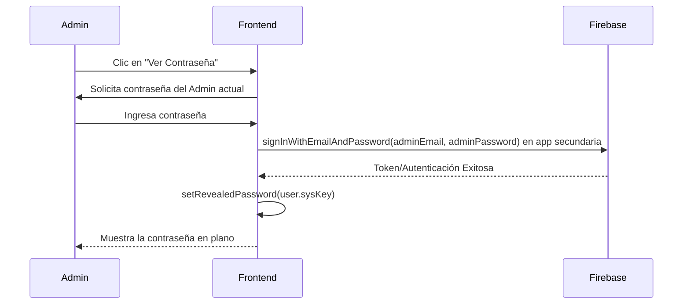

# 32. Gestión de Usuarios, Privilegios y Sesiones

Este documento técnico analiza exhaustivamente los mecanismos de gestión de identidades y accesos (IAM) de **Inventor Manager**. Exploraremos la implementación en la capa de vista (`UserManagementView.jsx`), las lógicas de protección de permisos (previamente conceptualizadas en módulos como `EditUserRoleModal`) y los sistemas de resguardo implementados a nivel de contexto global (`AuthContext.jsx`) para la terminación de sesiones inactivas.

El sistema debe proveer una administración centralizada y robusta que permita a los administradores manipular credenciales, sin comprometer su propia sesión, y al mismo tiempo prever errores que conduzcan a escalada de privilegios o exposición de la aplicación en terminales sin supervisión.

---

## 1. Arquitectura de Gestión de Usuarios (`UserManagementView.jsx`)

El módulo `UserManagementView.jsx` centraliza todas las operaciones de administración (CRUD) de la plantilla de trabajo. Emplea Firestore para persistir configuraciones y Firebase Authentication para las identidades subyacentes.

### 1.1 Flujo de Datos y Suscripción en Tiempo Real

El ciclo de vida del componente se apoya en `onSnapshot` para asegurar que las tarjetas de usuario mostradas por el administrador están siempre sincronizadas con la base de datos Firestore, evitando "condiciones de carrera" donde un administrador modifique datos caducados.

```javascript
  useEffect(() => {
    const q = query(collection(db, 'users'));
    const unsubscribe = onSnapshot(q, (snapshot) => {
      const data = snapshot.docs.map(d => ({ id: d.id, ...d.data() }));
      // Ordenamiento alfabético en tiempo de ejecución (lado del cliente)
      data.sort((a, b) => (a.displayName || a.name || '').toLowerCase().localeCompare((b.displayName || b.name || '').toLowerCase()));
      setUsers(data);
      setLoading(false);
    });
    return () => { unsubscribe(); };
  }, []);
```
> [!NOTE]
> **¿Por qué ordenar en el cliente?** En este escenario el volumen de usuarios por instancia es manejable en memoria. Ordenar mediante `.localeCompare()` permite ignorar case sensitivity e irregularidades de acentos sin requerir un índice compuesto o normalización forzada en Firestore.

### 1.2 La Creación Silenciosa de Usuarios (Secondary App Pattern)

Firebase Auth cierra sesión automáticamente del usuario actual cuando se invoca `createUserWithEmailAndPassword`. Para evitar que el administrador pierda su propia sesión, la aplicación utiliza una técnica de instanciación múltiple.

```javascript
    let secondaryApp = null;
    try {
      // 1. Instanciamos una app "temporal" independiente
      secondaryApp = initializeApp(firebaseConfig, `Secondary_${Date.now()}`);
      const secondaryAuth = getAuth(secondaryApp);
      
      // 2. Ejecutamos la creación usando la nueva instancia
      const cred = await createUserWithEmailAndPassword(secondaryAuth, newUser.email, newUser.password);
      
      // 3. Documentamos el perfil con roles base y categorías de inicio
      await setDoc(doc(db, 'users', cred.user.uid), {
        name: newUser.name, displayName: newUser.name, email: newUser.email,
        role: newUser.role, 
        allowedCategories: [...ALL_CATEGORIES], 
        editableCategories: [],
        allowedViews: ['dashboard', 'tornilleria', /* ... */, 'parques'],
        sysKey: newUser.password, // Se almacena temporalmente en plano
        passwordChangedAt: serverTimestamp(),
        createdAt: serverTimestamp()
      });
      // 4. Limpiamos sesión secundaria
      await signOut(secondaryAuth);
      // ...
    } finally {
      // 5. Destruimos la app temporal
      if (secondaryApp) deleteApp(secondaryApp).catch(console.error);
    }
```

> [!TIP]
> **Por qué funciona esta arquitectura:** Al usar un namespace único (`Secondary_${Date.now()}`), se evitan conflictos con la instancia nativa `[DEFAULT]` de Firebase. Es el método más seguro y robusto en arquitecturas _serverless_ web para manejar provisión de cuentas de terceros sin requerir una Cloud Function intermedia.

### 1.3 Asignación de Permisos Granulares y Roles

Anteriormente ideado como un modal externo (`EditUserRoleModal`), la complejidad requerida por los administradores recomendaba una gestión _in-situ_. El panel de configuración ha sido embebido directamente dentro de un diseño estilo "Acordeón" en la propia tarjeta de usuario.

Los accesos se dividen lógicamente en:
1. **Visibilidad (allowedViews):** ¿Qué rutas/menús puede ver el trabajador?
2. **Adición (allowedCategories):** ¿A qué categorías le está permitido agregar stock?
3. **Edición (editableCategories):** ¿Dónde puede modificar/eliminar transacciones previas?

El método `togglePermission` abstrae esta lógica, evaluando el campo sobre el que se hace clic y concatenando o filtrando el arreglo, con una peculiaridad crítica: **Sincronización Automática de Rutas**.

```javascript
      if (forceValue && (field === 'allowedCategories' || field === 'editableCategories')) {
        const viewIdMap = {
          'Tornillería': 'tornilleria', 'Papelería': 'papeleria', // ...
        };
        const viewId = viewIdMap[category];
        if (viewId && !(u.allowedViews || []).includes(viewId)) {
          updates.allowedViews = [...(u.allowedViews || []), viewId];
        }
      }
```
**El Qué y El Por Qué:** Si a un operario se le concede el poder de _agregar_ o _editar_ en "Tornillería", el sistema de manera implícita asume que necesita **ver** dicha sección. Inyectar automáticamente el `viewId` en los `allowedViews` mitiga errores humanos donde el administrador asigne permisos de escritura pero el usuario termine viendo una pantalla bloqueada de "Acceso Denegado".

---

## 2. Auditoría y Modificación de Credenciales (Contraseñas)

En entornos corporativos y de manufactura, es habitual el olvido de credenciales. La vista proporciona dos acciones directas:

1. **Reinicio/Cambio Directo:**
   Similar a la provisión, se crea una *Secondary App* para loguearse como el subordinado (valiéndose de la clave previamente almacenada, o pidiéndola) y se despacha `updatePassword`.
   
2. **Visualización de Contraseñas (Verificación de Identidad Admin):**

Para consultar la variable `sysKey` almacenada (la contraseña original en plano), el componente añade una capa de ficción, requiriendo que el administrador re-escriba su propia contraseña para desencriptar o mostrar el secreto en pantalla (`handleVerifyAdminPassword`).



> [!CAUTION]
> Guardar contraseñas explícitas en campos como `sysKey` es una desviación del paradigma habitual de Hashing seguro, dictada estrictamente por requerimientos operacionales concretos donde el supervisor requiere acceso incondicional y lectura directa de las credenciales de un área de trabajo compartida. 

---

## 3. Prevención de Escalada de Privilegios

La aplicación implementa restricciones defensivas (Guard Rails) en la interfaz de cliente. El objetivo es impedir el sabotaje inter-administradores o que un error reduzca la operatividad del sistema.

### 3.1 Defensas en el Componente de Administración

La interfaz aísla intencionalmente a otros administradores de sufrir menoscabos o alteraciones por parte del administrador de turno:

```javascript
// Protección contra eliminación
const handleDelete = async (u) => {
  if (u.role === 'admin') return toast.error('No puedes eliminar a este administrador');
  // ...
};
```
Asimismo, en la directiva de renderizado para los permisos (Acordeón de configuración), se omite deliberadamente la renderización de la interfaz de permisos en caso de ser administrador:

```javascript
{!isAdminUser && (
  <button
    onClick={() => setExpandedUserId(isExpanded ? null : u.id)}
    className={`um-btn-perms ${isExpanded ? 'expanded' : ''}`}
  >
    <Lock size={12} /> Permisos
  </button>
)}

// ...

{isExpanded && !isAdminUser && (
  <div className="um-perms-panel">
    {/* Panel de configuración deshabilitado para administradores */}
  </div>
)}
```

**Por qué:** Los Administradores, por definición funcional en `AuthContext.jsx`, retornan `true` explícito en las evaluaciones `canAddTo` y `canEditIn` saltándose el chequeo de arreglos. Permitir modificar sus campos `allowedCategories` crearía datos huérfanos que el sistema ignoraría de todos modos, induciendo a error visual y exponiendo funciones innecesarias.

---

## 4. Borrado de Sesiones Inactivas (Gestión de Ciclo de Vida del Contexto)

Una amenaza prevalente en aplicaciones web empresariales ocurre cuando un puesto físico (como un kiosco en el almacén) queda con la sesión abierta y sin supervisión. Inventor Manager delega al `AuthContext.jsx` el control paramétrico y de finalización autónoma de estas sesiones.

### 4.1 Variables y Escenarios de Cierre Automático

El temporizador monitoriza simultáneamente interacciones directas y estados de suspensión de la pestaña del navegador:

| Escenario | Condición Trigger | Límite Temporal | Acción Tomada |
| :--- | :--- | :--- | :--- |
| **Inactividad Activa** | No hay teclado, scroll, clics en primer plano | `30 * 60 * 1000` (30 min) | `logout()` y Toast Info |
| **Suspensión / Background** | El navegador es minimizado o pasa a segundo plano (Pestañas ocultas) | `60 * 60 * 1000` (60 min) | `logout()` en segundo plano |

### 4.2 Lógica de Throttle Optimizada (Evitando Sobrecargas)

Escuchar eventos genéricos (como `mousemove` o `scroll`) tradicionalmente produce picos enormes de renderizados de la pila de eventos. En el `AuthContext.jsx` se han implementado _Debouncing/Throttling_ rigurosos:

```javascript
    let lastActivity = Date.now();

    const resetTimer = () => {
      const now = Date.now();
      // Throttle: ignorar si la última actividad fue hace menos de 2 segundos
      if (now - lastActivity < 2000) return;
      lastActivity = now;
      
      if (inactivityTimer) clearTimeout(inactivityTimer);
      inactivityTimer = setTimeout(handleInactivity, INACTIVITY_MS);
    };

    const events = ['mousedown', 'keypress', 'scroll', 'touchstart'];
    events.forEach(event => {
      // Uso de { passive: true } crucial para el rendimiento de scroll web
      window.addEventListener(event, resetTimer, { passive: true });
    });
```
> [!IMPORTANT]
> **El modificador `{ passive: true }`**: Es fundamental porque instruye al navegador a que no espere que el hilo de JavaScript impida (`preventDefault`) el comportamiento de scroll. Evita "jank" y caídas de FPS, crucial para hardware antiguo o tabletas en el almacén.

### 4.3 Gestión del Page Visibility API

Cuando la aplicación va a segundo plano (`document.visibilityState === 'hidden'`), se asume que el usuario dejó la aplicación en suspensión (e.g. tablet bloqueada).

```javascript
    const handleVisibilityChange = () => {
      if (document.visibilityState === 'hidden') {
        backgroundTimer = setTimeout(() => {
          logout();
          // ...
        }, BACKGROUND_MS);
      } else {
        // Volvió al primer plano antes del timeout — cancelar cierre
        if (backgroundTimer) {
          clearTimeout(backgroundTimer);
          backgroundTimer = null;
        }
        resetTimer();
      }
    };
```
Esta mecánica garantiza doble contingencia y preserva un entorno altamente seguro, bloqueando accesos no autorizados sin depender de configuraciones engorrosas a nivel de servidor o sistema operativo.

---

## 5. Resumen de Flujo Crítico de Permisos

El sistema consolida una pirámide de privilegios:

1. **Admin (`role === 'admin'`):** Bypass inmediato en `AuthContext` (retorna siempre `true`). Inmune al panel de bloqueos.
2. **Almacenista (`role === 'almacenista'`):** Capaz de validar como *Staff* pero restringido al subconjunto de categorías indicadas en `allowedCategories` y `editableCategories`.
3. **Usuario Base (`role === 'user'`):** Solo operaciones de lectura en vistas autorizadas. Retorna `false` absoluto en comprobaciones tempranas de tipo *Staff*.

Esta distribución proporciona una barrera robusta a prueba de manipulaciones accidentales y ataques de escalada lateral en las instalaciones de Inventor Manager.
