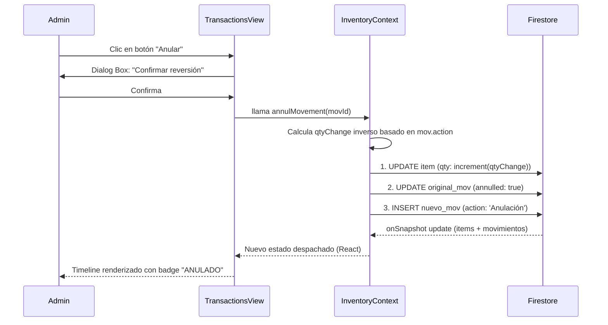

# 36. Historial de Movimientos e Interfaz de Transacciones

## 1. Introducción

El historial de movimientos es una pieza fundamental para la trazabilidad y auditoría de cualquier sistema de gestión de inventario. En Inventor Manager, este registro es orquestado de manera visual por el componente de interfaz `TransactionsView.jsx` (frecuentemente referido conceptualmente como *MovementsView*) y gestionado en su capa lógica por el proveedor de contexto `InventoryContextOptimized.jsx`.

Este capítulo aborda de manera meticulosa cómo el sistema renderiza el historial de actividades, cómo implementa un motor de filtrado eficiente en memoria para búsquedas instantáneas, y cómo permite a los administradores revertir transacciones mediante la función crítica de **Anulación (Void)**.

> [!NOTE]
> Aunque el requerimiento y la lógica subyacente tratan de "movimientos" (*movements*), en la base de código la vista responsable de renderizar este historial se denomina `TransactionsView.jsx`. Ambos términos son intercambiables en este contexto.

---

## 2. Arquitectura y Componentes Clave

La funcionalidad de historial de movimientos opera a través de dos archivos primarios, separando claramente la interfaz de usuario de la lógica de negocio y persistencia de datos:

1. **`src/views/TransactionsView.jsx`**: Es el componente de presentación. Se encarga de mostrar un *timeline* (línea de tiempo) cronológico con los movimientos. Contiene la lógica del filtrado en memoria (`useMemo`), la renderización condicional basada en permisos (Admin vs. Usuario), y la paleta de colores/iconos asignados dinámicamente según el tipo de acción.
2. **`src/context/InventoryContextOptimized.jsx`**: Contiene la definición del estado reactivo `movements` y expone el método `annulMovement`. Mantiene un *listener* en tiempo real (`onSnapshot`) sobre la colección `movements` de Firestore, almacenando los documentos de forma persistente a través del caché local (`localStorage`) para soporte *offline*.

---

## 3. Flujo de Datos y Renderizado Visual

El componente de interfaz importa el estado de los movimientos y procede a procesarlos para su visualización. Un mapa de configuración, `actionConfig`, se define al inicio del archivo para dotar a cada tipo de movimiento de una semántica visual:

```javascript
const actionConfig = {
  Entrada:     { label: 'Entrada',    color: '#34c759', bg: '#f0fff4', icon: ArrowUpCircle },
  Salida:      { label: 'Salida',     color: '#ff3b30', bg: '#fff1f1', icon: ArrowDownCircle },
  Préstamo:    { label: 'Préstamo',   color: '#5856d6', bg: '#f0f0ff', icon: HandMetal },
  Devolución:  { label: 'Devolución', color: '#0071e3', bg: '#f0f7ff', icon: RefreshCw },
  Anulación:   { label: 'Anulación',  color: '#64748b', bg: '#f1f5f9', icon: X },
  // ... otros tipos
};
```
*Este diccionario permite que el renderizado sea agnóstico a futuros tipos de movimientos; si el sistema añade un nuevo tipo de transacción, sólo debe integrarse en este objeto.*

### Visualización en Línea de Tiempo (Timeline)

La interfaz abandona la tradicional tabla de datos (la cual se oculta deliberadamente en dispositivos móviles mediante la clase `hidden-on-mobile` y estilos de display `none`) a favor de un diseño tipo *timeline* (`dash-timeline-item`, `dash-timeline-track`). 
Esto mejora sustancialmente la experiencia del usuario (UX), permitiendo una lectura jerárquica:
1. **Nodo y Conector**: Icono y línea de color conectora.
2. **Cabecera**: Etiqueta de acción (ej. "Entrada"), si está anulado (`badge` ANULADO), y fecha/hora.
3. **Cuerpo**: Nombre del artículo, categoría y detalle de la operación.
4. **Pie**: Usuario responsable, cantidad afectada, y el botón de anulación (exclusivo para Admins).

Además, los nombres de los artículos son *clickeables* y enrutan al usuario directamente al inventario pre-filtrando el término gracias al pase de estado a través de React Router (`navigate(route, { state: { prefillSearch: movement.item } })`).

---

## 4. Filtrado Avanzado en Memoria (In-Memory Filtering)

Dado que las consultas a bases de datos en la nube (como Firestore) incurren en latencia de red y costos de lectura por documento, el sistema implementa una estrategia híbrida: trae un conjunto de documentos recientes e implementa los filtros de forma local usando capacidades del cliente.

### Implementación mediante `useMemo`

En `TransactionsView.jsx`, el filtrado cruzado de **Fecha** y **Búsqueda General (Tipo/Item/Usuario)** se delega a `useMemo`. Al hacerlo, React solo recalcula la lista si cambian las dependencias (`movements`, `selectedDate`, `searchTerm`), garantizando así **rendimiento óptimo en colecciones grandes (Large Memory Arrays)** sin afectar el hilo principal (Main Thread).

```javascript
const filteredMovements = useMemo(() => {
  return movements.filter(m => {
    if (!m.timestamp) return false;
    
    // 1. Filtrado de Fecha Exacta
    const movDate = toLocalDateString(m.timestamp.toDate());
    if (movDate !== selectedDate) return false;
    
    // 2. Filtrado por Coincidencia Dinámica de Textos (Search)
    if (searchTerm) {
      const q = searchTerm.toLowerCase();
      const matchItem = (m.item || '').toLowerCase().includes(q);
      const matchAction = (m.action || '').toLowerCase().includes(q);
      const matchDetails = (m.details || '').toLowerCase().includes(q);
      const matchUser = (m.user || '').toLowerCase().includes(q);
      
      // Si el término no existe en ninguno de los campos, se excluye
      if (!matchItem && !matchAction && !matchDetails && !matchUser) return false;
    }
    
    return true; // Pasa todos los filtros
  });
}, [movements, selectedDate, searchTerm]);
```

> [!TIP]
> **Ventajas del enfoque *In-Memory*:**
> 1. **Cero Latencia**: Al presionar una tecla en el buscador, el resultado es inmediato, sin esperar a que un servidor remoto responda.
> 2. **Menos Costo de BD**: Se reducen drásticamente los `reads` a Firestore.
> 3. **Búsqueda Omnidireccional**: Un solo cuadro de texto (`searchTerm`) sirve para buscar al usuario que hizo el movimiento, el tipo de movimiento, los detalles, o el nombre de la pieza de inventario.

---

## 5. El Mecanismo de Anulación (Void / Rollback)

La anulación de una transacción es una acción crítica que no consiste simplemente en eliminar un documento de registro. Si un usuario registró una "Entrada" de 10 tornillos por accidente, borrar el registro no corrige el hecho de que el stock general tiene 10 tornillos extra.

El sistema contempla una **anulación transaccional**: revierte los valores matemáticos y lógicos en el artículo afectado, marca el registro histórico original como "Anulado" para mantener la traza de auditoría inalterable, y genera un nuevo movimiento compensatorio.

### 5.1 Restricción UI

En la vista, el botón de anular (ícono de `X`) solo se renderiza si se cumplen tres estrictas condiciones:
1. `isAdmin`: El contexto de autenticación confirma que el usuario es administrador.
2. `!mov.annulled`: El movimiento no ha sido anulado previamente.
3. `mov.action !== 'Anulación'`: No se permite "anular una anulación" para evitar bucles lógicos en el stock.

```javascript
{isAdmin && !mov.annulled && mov.action !== 'Anulación' && (
  <button 
    className="invt-btn-annul"
    title="Anular Movimiento"
    onClick={() => {
      if(window.confirm(`¿Seguro que deseas anular el movimiento de "${mov.item}"? Esta acción revertirá el stock.`)) {
        annulMovement(mov.id, userData?.name || 'Admin');
      }
    }}
  >
    <X size={14} />
  </button>
)}
```

### 5.2 Lógica de Reversión (`annulMovement`)

Ubicada en `InventoryContextOptimized.jsx`, esta función toma el `movementId` y ejecuta la compensación.

#### Paso A: Identificación
Primero, localiza el movimiento a anular. Extrae el `itemId` y busca el ítem en la referencia actual del inventario (`itemsRef.current`).

#### Paso B: Cálculo del Diferencial (Rollback)
Dependiendo de qué tipo de acción se está anulando, la variable `qtyChange` toma un valor inverso:
- **`Entrada` o `Alta`**: Se equivocaron al añadir stock. Por ende, la compensación es **negativa** (`-(mov.qty)`).
- **`Salida`**: Se equivocaron al retirar stock. La compensación es **positiva** (`+(mov.qty)`).
- **`Préstamo`**: Revierte un préstamo de stock. Incrementa el stock general `qtyChange = +1`, reduce la variable `prestados = prestados - 1`. Si los prestados caen a 0, el estatus vuelve a `'Disponible'`.
- **`Devolución`**: Revierte una devolución. Disminuye el stock `qtyChange = -1` y vuelve a subir el contador de `prestados = prestados + 1`.

```javascript
if (mov.action === 'Entrada' || mov.action === 'Alta') {
  qtyChange = -(mov.qty || 0);
} else if (mov.action === 'Salida') {
  qtyChange = (mov.qty || 0);
} else if (mov.action === 'Préstamo') {
  qtyChange = 1;
  extraFields.prestados = Math.max((item.prestados || 0) - 1, 0);
  if (extraFields.prestados === 0) extraFields.status = 'Disponible';
} //...
```

#### Paso C: Ejecución y Trazabilidad de Auditoría
Si hubieron cambios detectados, se ejecuta una escritura a la base de datos con *retries* exponenciales:
1. **Actualización del Ítem**: Se aplica la compensación matemática sobre las existencias reales usando `increment(qtyChange)`.
2. **Invalidación del Registro Original**: Se actualiza el documento del movimiento problemático fijando `annulled: true` y marcando quién fue el responsable de anularlo (`annulledBy`). ¡El documento original nunca se elimina de la base de datos!
3. **Registro Compensatorio**: Se crea un nuevo documento de movimiento con la acción `'Anulación'`, indicando el ítem, quién hizo la anulación y una nota automática *"Reversión de [Acción]"*.

> [!IMPORTANT]  
> **Integridad Referencial y Auditoría Ciega**
> Este diseño previene el fraude en sistemas de inventario. Los errores no se borran; se neutralizan. Cualquier persona que lea la base de datos sabrá exactamente:
> - Qué pasó en primera instancia.
> - Quién y cuándo se dio cuenta de que fue un error (Anulación).
> - Que la acción fue compensada exitosamente devolviendo el equilibrio a las cifras físicas.

---

## 6. Resumen de Flujo del Proceso

El flujo general desde que el administrador decide anular, hasta que el sistema responde, es el siguiente:



## 7. Conclusión

La arquitectura del historial de movimientos en Inventor Manager combina lo mejor de dos mundos: una lógica de anulación completamente robusta en el backend/context que protege la integridad de los datos simulando transacciones financieras (no se borra, se compensa), acoplado a una interfaz de alto rendimiento en el cliente que utiliza técnicas de memorización matemática (`useMemo`) para filtrar cientos de documentos de memoria grande (large arrays) instantáneamente sin incurrir en latencias molestas.
